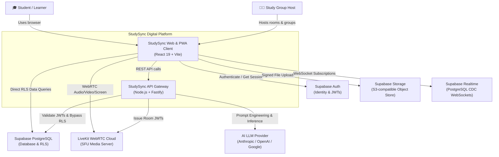
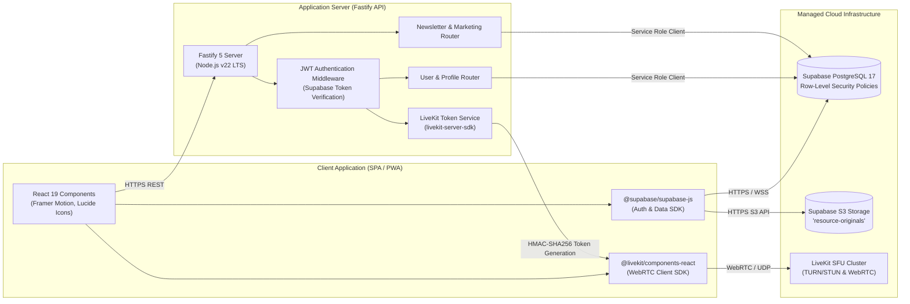
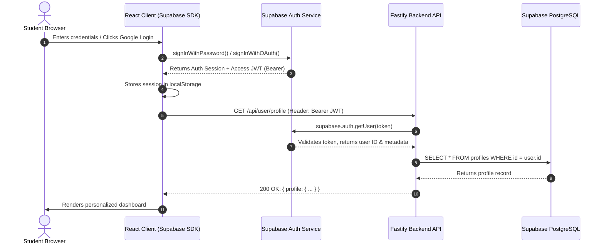
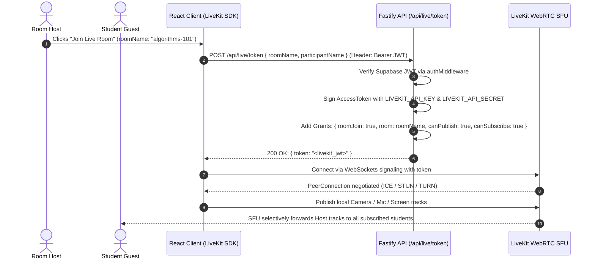
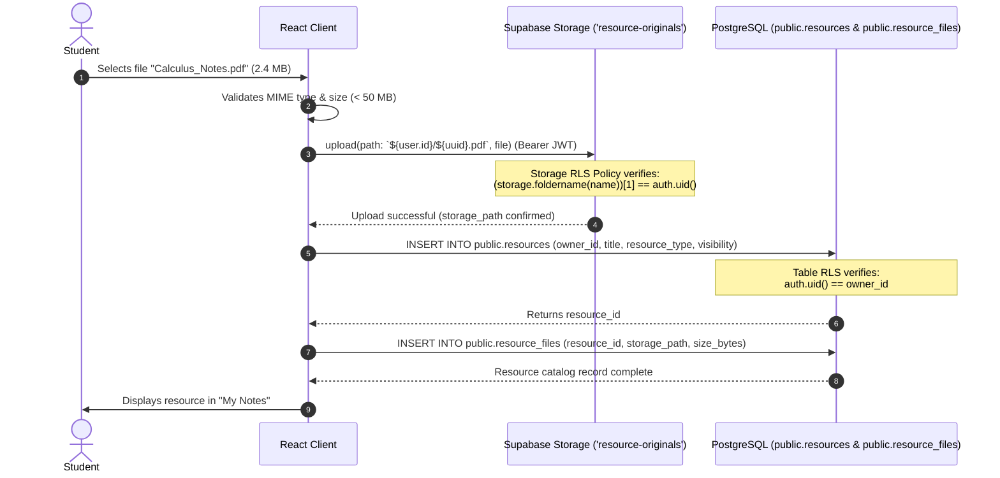

# System Architecture & Technical Design Document — StudySync

---

## 1. Architecture Overview & Principles

StudySync uses a modern, separated client-server architecture built on four architectural pillars:
1. **Separated Concerns**: Thin, reactive single-page client; secure, lightweight API gateway; managed high-availability backend-as-a-service.
2. **Zero-Secret Client**: All sensitive third-party API keys (LiveKit Secret, Supabase Service Role, AI Provider credentials) remain strictly on the Fastify backend server.
3. **Database-Level Security Boundary**: Authorization is enforced directly inside PostgreSQL using Row-Level Security (RLS) policies based on cryptographic JWT claims.
4. **Selective Forwarding Unit (SFU) WebRTC**: Collaborative video and audio rooms leverage LiveKit's SFU architecture instead of peer-to-peer mesh to scale to dozens of concurrent camera streams without overloading client uplink bandwidth.

---

## 2. C4 Architecture Model

### 2.1 Level 1: System Context Diagram
The System Context diagram illustrates how human actors interact with StudySync and its external ecosystem.



---

### 2.2 Level 2: Container Diagram
The Container diagram breaks down the subsystems, technologies, and inter-container protocols.



---

### 2.3 Level 3: Component Diagram (Fastify Backend API)

```
Backend/server/src/
├── app.ts                 # Fastify instance builder & CORS configuration
├── server.ts              # Process launcher (Host: 0.0.0.0, Port: 3001)
├── middleware/
│   └── authMiddleware.ts  # Pre-handler hook verifying Supabase Bearer JWTs
├── routes/
│   ├── userRoutes.ts      # GET /profile, PUT /profile with role-escalation defense
│   ├── liveRoutes.ts      # POST /token generating signed LiveKit access tokens
│   └── landingRoutes.ts   # POST /subscribe idempotent email newsletter ingestion
└── utils/
    └── supabase.ts        # Admin Supabase client singleton using SERVICE_ROLE_KEY
```

---

## 3. End-to-End Sequence Diagrams

### 3.1 Authentication & Session Hydration


---

### 3.2 Live Collaborative Room Token Issuance & WebRTC Connection


---

### 3.3 Resource Upload & Storage Security Flow


---

## 4. Technology Stack Justification

| Technology | Selection | Alternative Evaluated | Engineering Justification |
| :--- | :--- | :--- | :--- |
| **Frontend Framework** | **React 19 + TypeScript** | Vue.js, Svelte, Next.js | First-class compatibility with LiveKit React components (`@livekit/components-react`), strict type safety, zero server-side rendering latency overhead. |
| **Build Tooling** | **Vite 8** | Webpack, Turbopack | Sub-second Hot Module Replacement (HMR), lightweight ES module builds, native PWA plugin integration (`vite-plugin-pwa`). |
| **Backend Framework** | **Fastify 5** | Express.js, NestJS | 2x-3x higher requests/sec throughput than Express, built-in schema serialization, low overhead async plugin architecture, modern TypeScript support. |
| **Database & Auth** | **Supabase (PostgreSQL 17)** | Custom MongoDB + Auth0 | Row-Level Security (RLS) offers ironclad multi-tenancy at the data layer; integrated S3 object storage; built-in PostgreSQL change-data-capture (CDC) for realtime chat. |
| **Video/Audio WebRTC** | **LiveKit SFU** | Agora, Twilio, WebRTC Mesh | True Selective Forwarding Unit (SFU) reduces client bandwidth from $O(N^2)$ to $O(N)$; open-source with managed cloud availability; excellent React hooks. |
| **Styling & UI** | **Custom Design Tokens + Tailwind** | Material UI, Ant Design | Warm academic aesthetic (Ivory, Cobalt, Soft Sand, Coral) crafted specifically for student comfort without generic corporate look-and-feel. |

---

## 5. Security Architecture & Boundary Isolation

```
┌──────────────────────────────────────────────────────────────┐
│ UNTRUSTED ZONE: Public Internet & User Browser              │
│ - React 19 Client Bundle                                     │
│ - Supabase Anonymous Publishable Key (Read-safe, RLS-bound)  │
│ - Temporary User JWT in memory / local storage               │
└──────────────────────────────┬───────────────────────────────┘
                               │ HTTPS / WSS / WebRTC
                               ▼
┌──────────────────────────────────────────────────────────────┐
│ DEMILITARIZED ZONE (DMZ): Fastify API Gateway                │
│ - Strict CORS whitelisting (CLIENT_URL)                      │
│ - JWT Verification Pre-Handlers (requireAuth)                │
│ - Role Escalation Prevention                                 │
│ - LiveKit Token Minting (HMAC SHA-256)                       │
└──────────────────────────────┬───────────────────────────────┘
                               │ Private Network / Service Role
                               ▼
┌──────────────────────────────────────────────────────────────┐
│ TRUSTED ZONE: Managed Cloud Backends                         │
│ - Supabase Service Role Key (Database Admin)                 │
│ - PostgreSQL Tables protected by RLS Policies                │
│ - Private S3 Bucket ('resource-originals')                   │
│ - LiveKit SFU Cluster (Room Management API)                  │
└──────────────────────────────────────────────────────────────┘
```

1. **Defense in Depth**: Even if a malicious actor accesses the backend API directly, all data mutations require a verified Supabase JWT.
2. **PostgreSQL RLS as Final Authority**: If a compromised client queries the database directly with their user token, PostgreSQL policies prevent them from accessing any other student's private resources.
3. **Role Escalation Defense**: In `userRoutes.ts`, any client payload attempting to set `body.role` has the attribute stripped before executing the database update.
