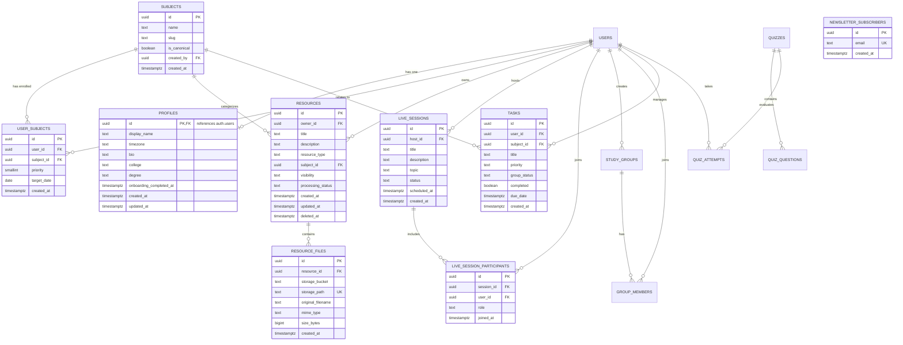

# Database Design & Data Dictionary — StudySync

---

## 1. Overview & Data Philosophy

StudySync's persistence layer is powered by **PostgreSQL 17** via Supabase. The database architecture is designed with the following principles:
- **Strict Referential Integrity**: Cascading deletes for user-owned sub-records, restrict constraints on shared relational models.
- **Defense-in-Depth via RLS**: Every tenant-isolated table has Row-Level Security enabled with granular `SELECT`, `INSERT`, `UPDATE`, and `DELETE` policies.
- **Index-Optimized Queries**: Composite and partial indexes for high-frequency queries (e.g., active resources by user, scheduled live rooms).
- **Soft Deletes**: Resources and sessions support soft deletion via `deleted_at timestamptz`.

---

## 2. Entity-Relationship (ER) Diagram



---

## 3. Data Dictionary

### 3.1 Table: `public.profiles`
Stores extended user profile information linked directly to Supabase's `auth.users`.
* **Primary Key**: `id` (UUID references `auth.users(id) on delete cascade`)
* **RLS Enabled**: Yes

| Column Name | Data Type | Nullable | Default | Constraints & Checks | Description |
| :--- | :--- | :--- | :--- | :--- | :--- |
| `id` | `uuid` | No | None | FK `auth.users(id)` | Unique user identifier matching Supabase Auth. |
| `display_name` | `text` | No | None | `check (char_length(trim(display_name)) between 1 and 80)` | Full public name or alias. |
| `timezone` | `text` | No | `'UTC'` | None | IANA timezone identifier for calendar calculations. |
| `bio` | `text` | Yes | `NULL` | None | Student bio and interests. |
| `college` | `text` | Yes | `NULL` | None | University or school name. |
| `degree` | `text` | Yes | `NULL` | None | Degree program or major (e.g., Computer Science). |
| `onboarding_completed_at`| `timestamptz` | Yes | `NULL` | None | Timestamp when initial onboarding wizard was completed. |
| `created_at` | `timestamptz` | No | `now()` | None | Record creation timestamp. |
| `updated_at` | `timestamptz` | No | `now()` | None | Last modification timestamp. |

---

### 3.2 Table: `public.subjects`
Represents academic subjects (both system-wide canonical subjects and custom user-defined subjects).
* **Primary Key**: `id` (UUID default `gen_random_uuid()`)
* **RLS Enabled**: Yes

| Column Name | Data Type | Nullable | Default | Constraints & Checks | Description |
| :--- | :--- | :--- | :--- | :--- | :--- |
| `id` | `uuid` | No | `gen_random_uuid()` | PK | Unique identifier for the subject. |
| `name` | `text` | No | None | `check (char_length(trim(name)) between 1 and 100)` | Name of subject (e.g., "Algorithms"). |
| `slug` | `text` | Yes | `NULL` | None | URL-safe slug for routing and indexing. |
| `is_canonical` | `boolean` | No | `false` | None | If true, visible to all users as a standard curriculum subject. |
| `created_by` | `uuid` | Yes | `NULL` | FK `auth.users(id) on delete set null` | Creator ID if custom subject; NULL if canonical. |
| `created_at` | `timestamptz` | No | `now()` | None | Creation timestamp. |

*Unique Constraint*: `unique (created_by, name)`

---

### 3.3 Table: `public.user_subjects`
Junction table tracking student course enrollments, priority weighting, and target completion dates.
* **Primary Key**: `id` (UUID default `gen_random_uuid()`)
* **RLS Enabled**: Yes

| Column Name | Data Type | Nullable | Default | Constraints & Checks | Description |
| :--- | :--- | :--- | :--- | :--- | :--- |
| `id` | `uuid` | No | `gen_random_uuid()` | PK | Record identifier. |
| `user_id` | `uuid` | No | None | FK `auth.users(id) on delete cascade` | User enrolled in subject. |
| `subject_id` | `uuid` | No | None | FK `public.subjects(id) on delete restrict` | Enrolled subject. |
| `priority` | `smallint` | No | `3` | `check (priority between 1 and 5)` | Study priority (1 = lowest, 5 = highest). |
| `target_date` | `date` | Yes | `NULL` | None | Target exam date or completion target. |
| `created_at` | `timestamptz` | No | `now()` | None | Record creation timestamp. |

*Unique Constraint*: `unique (user_id, subject_id)`

---

### 3.4 Table: `public.resources`
Metadata header for educational resources uploaded by students.
* **Primary Key**: `id` (UUID default `gen_random_uuid()`)
* **RLS Enabled**: Yes

| Column Name | Data Type | Nullable | Default | Constraints & Checks | Description |
| :--- | :--- | :--- | :--- | :--- | :--- |
| `id` | `uuid` | No | `gen_random_uuid()` | PK | Unique resource identifier. |
| `owner_id` | `uuid` | No | None | FK `auth.users(id) on delete cascade` | Student who owns the resource. |
| `title` | `text` | No | None | `check (char_length(trim(title)) between 1 and 180)` | Resource title. |
| `description` | `text` | Yes | `NULL` | None | Description, chapter notes, or summary. |
| `resource_type` | `text` | No | None | `check (resource_type in ('pdf', 'image', 'text', 'video_link'))` | Format categorization. |
| `subject_id` | `uuid` | Yes | `NULL` | FK `public.subjects(id) on delete set null` | Associated subject. |
| `visibility` | `text` | No | `'private'` | `check (visibility = 'private')` | Access scope (enforced private in MVP). |
| `processing_status`| `text` | No | `'uploading'` | `check (processing_status in ('uploading', 'processing', 'ready', 'failed', 'quarantined'))` | Async indexing and virus check status. |
| `created_at` | `timestamptz` | No | `now()` | None | Upload start timestamp. |
| `updated_at` | `timestamptz` | No | `now()` | None | Last update timestamp. |
| `deleted_at` | `timestamptz` | Yes | `NULL` | None | Soft-delete timestamp if deleted. |

---

### 3.5 Table: `public.resource_files`
Storage pointer linking database resource headers to binary blobs in Supabase Storage.
* **Primary Key**: `id` (UUID default `gen_random_uuid()`)
* **RLS Enabled**: Yes

| Column Name | Data Type | Nullable | Default | Constraints & Checks | Description |
| :--- | :--- | :--- | :--- | :--- | :--- |
| `id` | `uuid` | No | `gen_random_uuid()` | PK | Unique file reference identifier. |
| `resource_id` | `uuid` | No | None | FK `public.resources(id) on delete cascade` | Parent resource header. |
| `storage_bucket`| `text` | No | `'resource-originals'` | `check (storage_bucket = 'resource-originals')` | Target storage bucket name. |
| `storage_path` | `text` | No | None | `unique` | Full S3 key (e.g. `<user_id>/<uuid>.pdf`). |
| `original_filename`| `text` | No | None | None | Original uploaded file name. |
| `mime_type` | `text` | No | None | None | Verified IANA MIME media type. |
| `size_bytes` | `bigint` | No | None | `check (size_bytes > 0 and size_bytes <= 52428800)` | Binary size in bytes (max 50 MB). |
| `created_at` | `timestamptz` | No | `now()` | None | Record creation timestamp. |

---

### 3.6 Table: `public.live_sessions`
Tracks active and scheduled WebRTC video/audio study sessions.
* **Primary Key**: `id` (UUID default `gen_random_uuid()`)
* **RLS Enabled**: Yes

| Column Name | Data Type | Nullable | Default | Constraints | Description |
| :--- | :--- | :--- | :--- | :--- | :--- |
| `id` | `uuid` | No | `gen_random_uuid()` | PK | Session identifier / LiveKit room name. |
| `host_id` | `uuid` | No | None | FK `auth.users(id)` | Session creator and primary host. |
| `title` | `text` | No | None | None | Display title of the study room. |
| `description` | `text` | Yes | `NULL` | None | Topic or study agenda. |
| `topic` | `text` | Yes | `NULL` | None | Subject or domain tag. |
| `status` | `text` | No | `'scheduled'` | `in ('scheduled', 'live', 'ended')` | Operational state of the room. |
| `scheduled_at` | `timestamptz` | Yes | `NULL` | None | Planned start time. |
| `created_at` | `timestamptz` | No | `now()` | None | Creation timestamp. |

---

### 3.7 Table: `public.live_session_participants`
Real-time roster of participants connected to a live study session.
* **Primary Key**: `id` (UUID default `gen_random_uuid()`)
* **Unique Constraint**: `unique (session_id, user_id)`
* **RLS Enabled**: Yes

| Column Name | Data Type | Nullable | Default | Constraints | Description |
| :--- | :--- | :--- | :--- | :--- | :--- |
| `id` | `uuid` | No | `gen_random_uuid()` | PK | Participant attendance ID. |
| `session_id` | `uuid` | No | None | FK `live_sessions(id) on delete cascade` | Room identifier. |
| `user_id` | `uuid` | No | None | FK `auth.users(id) on delete cascade` | Connected user ID. |
| `role` | `text` | No | `'participant'` | `in ('host', 'co-host', 'participant')` | Permission level inside room. |
| `joined_at` | `timestamptz` | No | `now()` | None | Timestamp user entered room. |

---

### 3.8 Table: `public.tasks`
User task management tracking assignments and study goals.
* **Primary Key**: `id` (UUID default `gen_random_uuid()`)
* **RLS Enabled**: Yes

| Column Name | Data Type | Nullable | Default | Constraints | Description |
| :--- | :--- | :--- | :--- | :--- | :--- |
| `id` | `uuid` | No | `gen_random_uuid()` | PK | Task identifier. |
| `user_id` | `uuid` | No | None | FK `auth.users(id) on delete cascade` | Task owner. |
| `subject_id` | `uuid` | Yes | `NULL` | FK `subjects(id)` | Associated subject. |
| `title` | `text` | No | None | None | Task description. |
| `priority` | `text` | No | `'Medium'` | `in ('High', 'Medium', 'Low')` | Priority level. |
| `group_status` | `text` | No | `'TODAY'` | `in ('TODAY', 'TOMORROW', 'THIS WEEK', 'LATER', 'COMPLETED')` | Kanban column bucket. |
| `completed` | `boolean` | No | `false` | None | Boolean completion indicator. |
| `due_date` | `timestamptz` | Yes | `NULL` | None | Due date and time. |
| `created_at` | `timestamptz` | No | `now()` | None | Creation timestamp. |

---

### 3.9 Table: `public.newsletter_subscribers`
Landing page email subscription capture table.
* **Primary Key**: `id` (UUID default `gen_random_uuid()`)
* **Unique Constraint**: `email` (`error code 23505` on collision)

| Column Name | Data Type | Nullable | Default | Description |
| :--- | :--- | :--- | :--- | :--- |
| `id` | `uuid` | No | `gen_random_uuid()` | Unique subscription identifier. |
| `email` | `text` | No | None | Validated email address. |
| `created_at` | `timestamptz` | No | `now()` | Timestamp of subscription. |

---

## 4. Row-Level Security (RLS) Policy Catalog

| Table | Policy Name | Command | Target Role | Using / With Check Expression |
| :--- | :--- | :--- | :--- | :--- |
| `profiles` | Users can read their profile | `SELECT` | `authenticated` | `(select auth.uid()) = id` |
| `profiles` | Users can create their profile | `INSERT` | `authenticated` | `(select auth.uid()) = id` |
| `profiles` | Users can update their profile | `UPDATE` | `authenticated` | `(select auth.uid()) = id` |
| `subjects` | Read canonical or own subjects | `SELECT` | `authenticated` | `is_canonical or (select auth.uid()) = created_by` |
| `subjects` | Create custom subjects | `INSERT` | `authenticated` | `(select auth.uid()) = created_by and not is_canonical` |
| `subjects` | Update custom subjects | `UPDATE` | `authenticated` | `(select auth.uid()) = created_by and not is_canonical` |
| `subjects` | Delete custom subjects | `DELETE` | `authenticated` | `(select auth.uid()) = created_by and not is_canonical` |
| `user_subjects` | Manage subject preferences | `ALL` | `authenticated` | `(select auth.uid()) = user_id` |
| `resources` | Manage private resources | `ALL` | `authenticated` | `(select auth.uid()) = owner_id and visibility = 'private'` |
| `resource_files`| Manage files for their resources | `ALL` | `authenticated` | `exists (select 1 from public.resources where resources.id = resource_files.resource_id and resources.owner_id = (select auth.uid()))` |
| `storage.objects`| Upload private resource files | `INSERT`| `authenticated` | `bucket_id = 'resource-originals' and (storage.foldername(name))[1] = (select auth.jwt()->>'sub')` |
| `storage.objects`| Read private resource files | `SELECT`| `authenticated` | `bucket_id = 'resource-originals' and (storage.foldername(name))[1] = (select auth.jwt()->>'sub')` |
| `storage.objects`| Delete private resource files | `DELETE`| `authenticated` | `bucket_id = 'resource-originals' and (storage.foldername(name))[1] = (select auth.jwt()->>'sub')` |

---

## 5. Indexing & Query Optimization

```sql
-- Resource library indexing for fast owner queries and subject filters
create index resources_owner_created_at_idx 
on public.resources (owner_id, created_at desc) 
where deleted_at is null;

create index resources_subject_created_at_idx 
on public.resources (subject_id, created_at desc) 
where deleted_at is null;

-- Relational join index on resource files
create index resource_files_resource_id_idx 
on public.resource_files (resource_id);

-- Live session directory queries
create index live_sessions_status_scheduled_idx
on public.live_sessions (status, scheduled_at asc);

-- Task filtering by owner and completion
create index tasks_user_group_idx
on public.tasks (user_id, group_status, completed);
```
