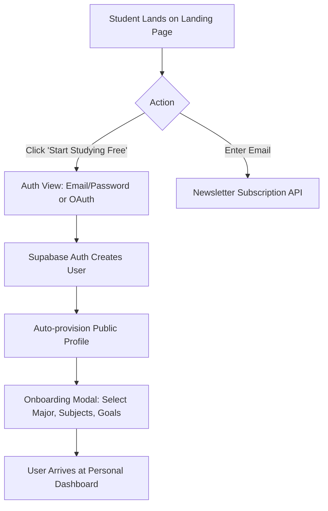
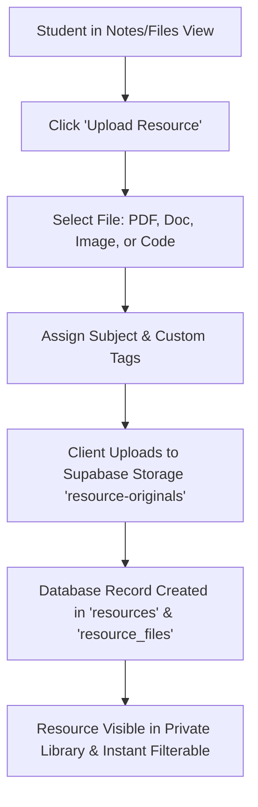
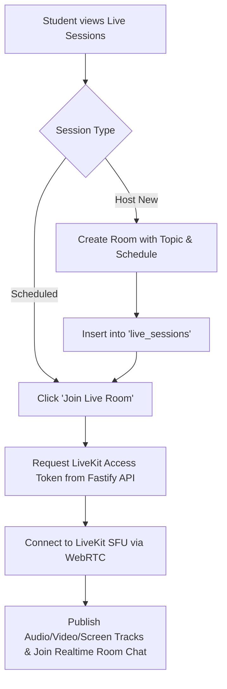

# Product Requirements Document (PRD) — StudySync

---

## 1. Executive Summary & Vision

### 1.1 Vision Statement
**StudySync** is a unified, student-first learning companion designed to eliminate academic friction. It consolidates scattered lecture slides, deadlines, study partners, and AI academic assistance into a single, cohesive, distraction-free digital campus.

### 1.2 Mission
To empower students to take control of their learning by transforming chaotic course syllabi, fragmented resources, and isolation into structured, collaborative, and achievable study routines.

### 1.3 Core Product Philosophy
1. **Reduce Friction First**: Make creating a schedule, uploading a note, or joining a study room happen in fewer than three clicks.
2. **Warm Academic Aesthetic**: Avoid sterile corporate enterprise tools or chaotic gamified distractions. Provide an inviting, calm, and focused space.
3. **Collaboration with Accountability**: Foster peer study groups and live audio/video focus rooms with built-in accountability metrics.
4. **Responsible AI Co-pilot**: AI should scaffold student learning through constraint-aware scheduling, concept decomposition, and self-quizzing—never by bypassing active learning.

---

## 2. Target Audience & User Personas

### 2.1 Primary User Personas

#### Persona 1: Sarah — The Overwhelmed STEM Undergraduate
* **Demographics**: 20 years old, 2nd-year Computer Science student, takes 5 courses simultaneously.
* **Pain Points**:
  - Course materials are scattered across Canvas, Google Drive, Discord, and local downloads.
  - Constantly misses assignment deadlines because exam dates and lab due dates are not integrated into a single view.
  - Feels isolated when studying complex theoretical concepts late at night.
* **Needs**:
  - A single searchable repository for notes and code snippets categorized by subject.
  - A smart study planner that breaks down exam prep across available calendar days.
  - Live virtual study rooms where peers keep each other accountable on camera.

#### Persona 2: Marcus — The Self-Paced Exam Aspirant
* **Demographics**: 23 years old, preparing for professional/graduate certifications alongside part-time work.
* **Pain Points**:
  - Has fragmented study blocks (1-2 hours in the morning, 2 hours in the evening).
  - Struggles to estimate how much time each chapter requires.
  - Lacks immediate feedback on comprehension until formal practice tests.
* **Needs**:
  - Time-budgeted schedule generation adapting to fixed work commitments.
  - Fast, subject-level quiz generation and flashcard review to test retention.
  - Streak tracking and progress visualizations to sustain motivation.

#### Persona 3: Maya — The Peer Tutor & Group Lead
* **Demographics**: 21 years old, 3rd-year Biology major, leads an organic chemistry peer group.
* **Pain Points**:
  - Coordinating study sessions via group chats results in low attendance and confusion over links.
  - Sharing large lecture slides and annotated diagrams gets lost in chat feeds.
* **Needs**:
  - Dedicated Study Groups with persistent member rosters and discussion boards.
  - One-click Live Study Rooms with WebRTC screen sharing and low-latency audio.
  - Shared repository pinned to the group workspace.

---

## 3. Problem Statement & Market Opportunity

| Traditional Reality | The StudySync Solution |
| :--- | :--- |
| **Tool Sprawl**: Students jump between Notion, Google Calendar, Zoom, Quizlet, and WhatsApp. | **Unified Learning Workspace**: Planning, resources, live WebRTC rooms, quizzes, and tasks in one place. |
| **Passive Procrastination**: Overwhelmed by semester syllabi without actionable daily breakdowns. | **Constraint-Aware Scheduling**: Automatic daily pacing based on available hours and exam dates. |
| **High Friction Video Meetings**: Setting up Zoom/Meet links with calendar invites is tedious. | **Instant One-Click Live Rooms**: Integrated WebRTC rooms powered by LiveKit with zero external software needed. |
| **Isolated Frustration**: Getting stuck on a concept at 1:00 AM leads to abandoning study sessions. | **AI Academic Assistant & Peer Doubts**: Safe, context-aware explanations and group discussion threads. |

---

## 4. User Journeys & Core Flows

### 4.1 Onboarding & Setup Flow

### 4.2 Resource Library & Organization Flow

### 4.3 Live Study Room Collaborative Flow

---

## 5. Feature Scope & Phased Roadmap

### 5.1 Phase 1: MVP Core (Current State & Foundation)
* **Authentication**: Supabase Auth (Email/Password, Google OAuth), session persistence, user profiles (`profiles`).
* **Personal Dashboard**: Daily streak counter, weekly study hours tracker, upcoming deadlines list, today's schedule preview.
* **Resource Library (Private)**:
  - Upload and manage PDFs, images, documents, and code files.
  - File categorization by subject (`subjects`, `user_subjects`, `resources`, `resource_files`).
  - Search by file name and topic.
* **Live Study Rooms (WebRTC)**:
  - LiveKit token generation through Fastify server (`/api/live/token`).
  - Multi-participant video/audio room with screen sharing and participant list.
  - Real-time room text chat powered by Supabase Realtime and LiveKit data channels.
* **Task Manager**: Filterable task board (Today, Tomorrow, Upcoming, Completed, Overdue) with priority tags.
* **Study Planner**: Daily, Weekly, and Monthly visual schedule views with Pomodoro focus timer controls.
* **Responsive Layout**: Desktop drawer, collapsible sidebar, mobile navigation drawer, dark/light theme switching.

### 5.2 Phase 2: Collaboration & AI Co-Pilot (Upcoming)
* **Study Groups & Communities**:
  - Discoverable public and private groups with member roles (Admin, Member).
  - Group-specific shared document repository and doubt board.
* **AI Study Schedule Generator**:
  - User inputs exam date, syllabus topics, and daily available study windows.
  - Server-side LLM outputs an optimized, conflict-free, editable calendar schedule.
* **Interactive Quizzes & Flashcards**:
  - Subject and topic-based multiple choice quizzes.
  - Automated grading, streak multipliers, and retention tracking.
* **AI Note Explainer & Doubt Assistant**:
  - In-app context-aware Q&A on uploaded lecture notes.

### 5.3 Phase 3: Institutional & Enterprise Expansion (Future)
* **Institutional Dashboards**: Aggregate student engagement metrics for universities and schools.
* **Verified Tutor Marketplace**: 1-on-1 scheduled tutoring sessions with escrow payment processing.
* **Offline-First PWA Sync**: Full local offline caching of resources with automatic background sync.

---

## 6. Success Metrics & Key Performance Indicators (KPIs)

| Metric | Target (First 90 Days) | Measurement Method |
| :--- | :--- | :--- |
| **Activation Rate** | > 65% | Percentage of signed-up users who upload 1+ resource or schedule 1+ task in first 24h. |
| **Live Session Engagement** | > 45 minutes avg session | Total active duration spent inside LiveKit rooms per user per week. |
| **Weekly Retention (W1/W4)** | W1 > 40%, W4 > 25% | Cohort analysis of returning users who engage with planner or notes. |
| **Daily Streak Adherence** | > 35% users with 5+ day streak | Users completing at least one task or study block daily. |
| **Upload Processing Reliability** | 99.9% successful uploads | Errors reported in Supabase Storage or Fastify upload handler. |
| **WebRTC Media Reliability** | < 1% connection drops | LiveKit room connection failure rates and packet loss telemetry. |

---

## 7. Assumptions, Dependencies & Risks

### 7.1 Assumptions
1. Students possess a broadband internet connection capable of at least 1.5 Mbps upload/download for WebRTC video rooms.
2. Modern Evergreen browsers (Chrome, Edge, Firefox, Safari) with WebRTC and ECMAScript 2022+ support are used.
3. Third-party auth providers (Google OAuth via Supabase) will remain available with 99.95%+ uptime.

### 7.2 Key Dependencies
- **Supabase Cloud / Local**: Authentication, PostgreSQL database, Storage bucket (`resource-originals`), and Realtime engine.
- **LiveKit Server / Cloud**: SFU (Selective Forwarding Unit) WebRTC infrastructure for high-scale audio/video streaming.
- **Fastify Backend**: Token issuing gateway, administrative services, and future AI LLM orchestration.

### 7.3 Risk Mitigation
- **Risk: Student Data Privacy & FERPA Violations**  
  *Mitigation*: Strict PostgreSQL Row-Level Security (RLS) ensures students can only read and write their own private resources; public groups require explicit opt-in.
- **Risk: WebRTC Bandwidth Costs**  
  *Mitigation*: LiveKit dynamic simulcast and adaptive stream resolution downscale video feeds when multiple participants are present or windows are small.
