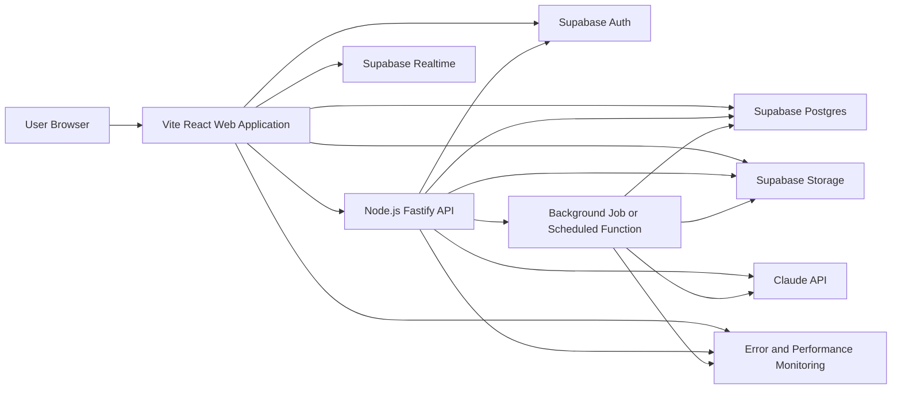
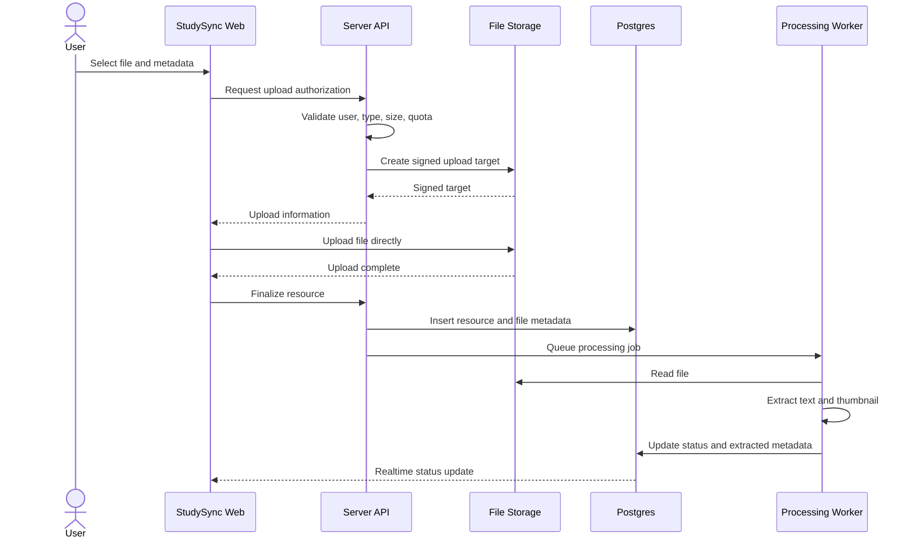
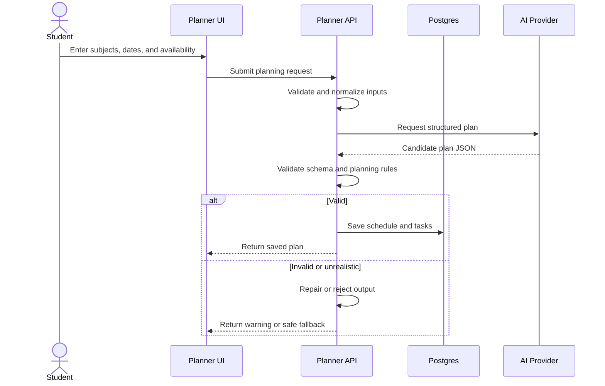
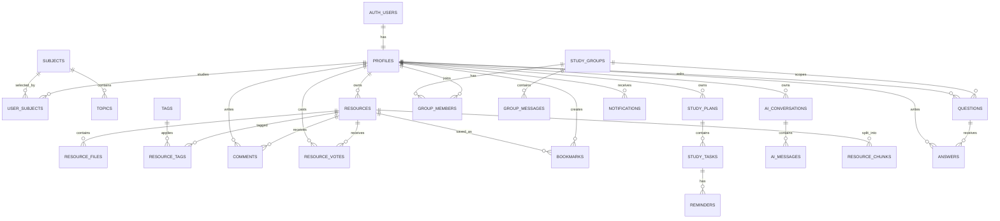
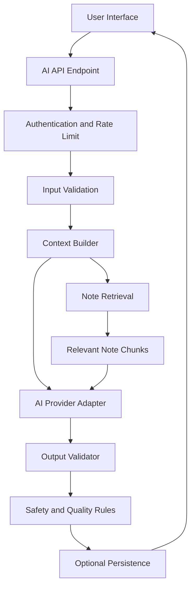
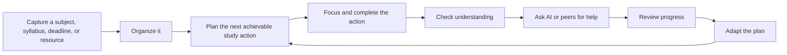
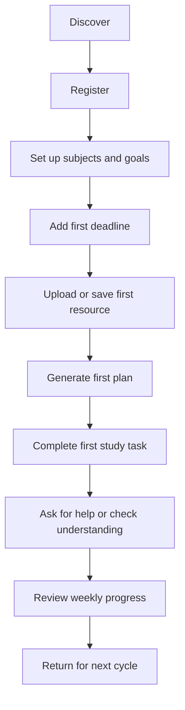
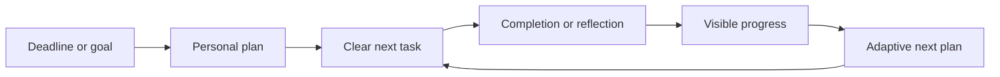

# StudySync — Complete Master Product Dossier

> **Document type:** All-in-one product concept, business strategy, Product Requirements Document (PRD), brand blueprint, UI/UX specification, technical architecture, AI design, community framework, launch plan, operating model, and complete artifact checklist  
> **Source:** Fully expanded from the four-page *StudySync — Product & Technical Blueprint*  
> **Edition:** Master consolidated edition  
> **Status:** Strategy-ready, design-ready, and implementation-ready planning document  
> **Primary platform:** Responsive web application and installable Progressive Web App  
> **Future platforms:** Android and iOS applications  
> **Primary audience:** Students; later, tutors, mentors, study-group leaders, and educational institutions  
> **Planning principle:** Build the smallest reliable learning loop first, validate it with real students, and expand only after evidence  
> **Highest-priority AI feature:** Constraint-aware, editable study schedule generator  
> **Product promise:** Turn scattered study materials, deadlines, doubts, and available time into one clear, achievable learning system

---

## Table of Contents

1. [Executive Summary](#1-executive-summary)
2. [Source PDF Analysis](#2-source-pdf-analysis)
3. [Product Vision](#3-product-vision)
4. [Locked Decisions, Assumptions, and Scope](#4-locked-decisions-assumptions-and-scope)
5. [Target Users and Roles](#5-target-users-and-roles)
6. [User Problems and Product Goals](#6-user-problems-and-product-goals)
7. [Feature Architecture](#7-feature-architecture)
8. [Detailed Functional Requirements](#8-detailed-functional-requirements)
9. [Information Architecture and Navigation](#9-information-architecture-and-navigation)
10. [Complete Screen Inventory](#10-complete-screen-inventory)
11. [UI/UX Design System](#11-uiux-design-system)
12. [Responsive and Accessibility Requirements](#12-responsive-and-accessibility-requirements)
13. [Recommended Technology Stack](#13-recommended-technology-stack)
14. [System Architecture](#14-system-architecture)
15. [Repository and Project Structure](#15-repository-and-project-structure)
16. [Database Design](#16-database-design)
17. [Authorization and Row-Level Security](#17-authorization-and-row-level-security)
18. [API Design](#18-api-design)
19. [File Upload and Processing Architecture](#19-file-upload-and-processing-architecture)
20. [AI System Design](#20-ai-system-design)
21. [Search, Realtime, Notifications, and Jobs](#21-search-realtime-notifications-and-jobs)
22. [Security, Privacy, and Moderation](#22-security-privacy-and-moderation)
23. [Performance and Scalability](#23-performance-and-scalability)
24. [Analytics and Observability](#24-analytics-and-observability)
25. [Testing Strategy](#25-testing-strategy)
26. [Deployment and Environments](#26-deployment-and-environments)
27. [Phased Development Roadmap](#27-phased-development-roadmap)
28. [Complete Artifact Inventory](#28-complete-artifact-inventory)
29. [Definition of Done](#29-definition-of-done)
30. [Risks and Mitigations](#30-risks-and-mitigations)
31. [Future Expansion](#31-future-expansion)
32. [Recommended First Implementation Slice](#32-recommended-first-implementation-slice)
33. [Open Product Decisions](#33-open-product-decisions)
34. [The Idea Behind StudySync](#34-the-idea-behind-studysync)
35. [Product Story, Positioning, and Brand Narrative](#35-product-story-positioning-and-brand-narrative)
36. [Core Experience Model and Student Lifecycle](#36-core-experience-model-and-student-lifecycle)
37. [Unique Differentiation and Defensible Product Advantages](#37-unique-differentiation-and-defensible-product-advantages)
38. [Expanded Features That Make StudySync More Useful](#38-expanded-features-that-make-studysync-more-useful)
39. [End-to-End User Journeys](#39-end-to-end-user-journeys)
40. [Content, Curriculum, and Resource Taxonomy](#40-content-curriculum-and-resource-taxonomy)
41. [Community, Collaboration, and Knowledge Quality Model](#41-community-collaboration-and-knowledge-quality-model)
42. [Student Wellbeing, Academic Integrity, and Responsible Design](#42-student-wellbeing-academic-integrity-and-responsible-design)
43. [Personalization and Recommendation Strategy](#43-personalization-and-recommendation-strategy)
44. [Learning-System Design Principles](#44-learning-system-design-principles)
45. [Engagement, Retention, and Notification Strategy](#45-engagement-retention-and-notification-strategy)
46. [Business Model and Monetization](#46-business-model-and-monetization)
47. [Go-to-Market and Launch Strategy](#47-go-to-market-and-launch-strategy)
48. [Growth Loops and Partnership Strategy](#48-growth-loops-and-partnership-strategy)
49. [Customer Support and Product Operations](#49-customer-support-and-product-operations)
50. [Legal, Privacy, Compliance, and Policy Readiness](#50-legal-privacy-compliance-and-policy-readiness)
51. [Content Strategy and Product Microcopy](#51-content-strategy-and-product-microcopy)
52. [Expanded Metrics, Dashboards, and Decision Framework](#52-expanded-metrics-dashboards-and-decision-framework)
53. [Feature Prioritization Matrix](#53-feature-prioritization-matrix)
54. [Suggested Twelve-Month Product Plan](#54-suggested-twelve-month-product-plan)
55. [Team, Ownership, and Working Model](#55-team-ownership-and-working-model)
56. [Budget and Cost-Control Framework](#56-budget-and-cost-control-framework)
57. [Current Technology Validation and Source References](#57-current-technology-validation-and-source-references)
58. [Master Build and Launch Checklist](#58-master-build-and-launch-checklist)
59. [Final Product North Star](#59-final-product-north-star)

---

# 1. Executive Summary

> **Master-edition note:** This document now covers the complete idea behind StudySync—not only its technology. It includes the user problem, learning philosophy, brand, product strategy, detailed experience, business model, community design, student wellbeing, legal readiness, launch plan, operating model, and a full implementation blueprint.


StudySync is a collaborative study platform where students can:

- Upload, organize, search, view, and download educational resources.
- Share PDFs, images, plain-text notes, videos, and external video links.
- Build AI-generated study schedules based on subjects, examination dates, priorities, and available time.
- Ask academic questions and receive explanations from other learners or an AI assistant.
- Request summaries and simplified explanations of uploaded notes.
- Participate in study groups, discussions, shared tasks, and doubt boards.
- Track tasks, reminders, and later-stage learning progress.

The original blueprint correctly establishes two important principles:

1. **The product must be built in small, usable phases.**
2. **The AI study schedule generator must be built before the AI doubt-solving assistant and note explainer.**

This expanded specification preserves those decisions and turns the concept into an implementation-ready plan.

## Recommended MVP architecture

For the first production-capable version, use:

- **React, Vite, and TypeScript** for the responsive web application.
- **Node.js with Fastify and TypeScript** for the server API.
- **Tailwind CSS** and a reusable component system for UI implementation.
- **Supabase Postgres** for relational data.
- **Supabase Auth** for email/password authentication.
- **Supabase Storage** for private and public educational resources.
- **Supabase Realtime** for notifications and later collaboration features.
- **Claude API through a secure server endpoint** for schedule generation, academic Q&A, and note explanation.
- Static hosting for the Vite web application and a Node.js-compatible host for the API.
- **Supabase-managed infrastructure** for the database, authentication, file storage, and realtime services.
- **Sentry or equivalent** for error monitoring.
- **Automated CI checks** for linting, type checking, tests, and production builds.

This keeps the frontend and backend clearly separated while retaining TypeScript across the product. Fastify is the default Node.js framework; Express remains an acceptable alternative if the team prefers it.

---

# 2. Source PDF Analysis

## 2.1 Page 1 analysis

The first page defines:

- The StudySync product concept.
- The “bare minimum first” build philosophy.
- The AI feature order.
- Three initial user types:
  - Student.
  - Group admin.
  - Tutor or mentor as a future trusted contributor.
- The first three major feature areas:
  - Notes and resource sharing.
  - Collaborative study.
  - AI assistant.
- The study schedule generator as the first AI feature.

### Important implications

- The platform is not only a file-sharing site; it combines content, planning, community, and AI.
- The initial release should not attempt to build every collaboration feature.
- Resource organization requires structured subjects, topics, tags, ownership, permissions, and search.
- Rating, commenting, and downloading introduce moderation, analytics, and access-control needs.
- Group features should be designed in the data model early even if they are implemented later.

## 2.2 Page 2 analysis

The second page completes the AI feature list and introduces:

- Doubt-solving chat.
- Uploaded-note explanation.
- Future quiz generation.
- Future progress tracking.
- Account and profile functions.
- Notifications.
- Future social and gamification features.
- A six-layer architecture:
  - Frontend.
  - Backend/API.
  - Database.
  - File storage.
  - AI service.
  - Authentication.
- An example AI request lifecycle.
- The beginning of a suggested beginner-friendly technology stack.

### Important implications

- AI calls must never be made directly from the browser with a secret API key.
- Notifications will require an event model, delivery preferences, unread state, and background processing.
- “My notes” and shared notes require ownership and visibility rules.
- Progress tracking should be treated as a later analytics feature, not mixed into the first scheduler.
- The platform requires separate data storage for metadata and file objects.

## 2.3 Page 3 analysis

The third page defines:

- File storage, AI, authentication, and hosting options.
- A first-pass data model.
- A nine-phase roadmap.
- The beginning of future stretch ideas.

### Important implications

- The listed entities form a useful starting point but are not sufficient for production.
- Many-to-many relationships need junction tables rather than array fields.
- User passwords must be handled by the authentication provider, not stored in an application profile table.
- File metadata, comments, tags, votes, bookmarks, memberships, reminders, AI messages, and notifications require dedicated tables.
- The roadmap is sound, but each phase needs measurable entry and exit criteria.

## 2.4 Page 4 analysis

The fourth page lists future opportunities:

- Mobile applications.
- Realtime collaborative editing.
- Voice-based AI tutor.
- Spaced-repetition flashcards.
- Google Calendar integration.
- Personal analytics.

### Important implications

- APIs and data models should remain mobile-ready.
- Calendar export and synchronization should not be tightly coupled to one provider.
- Realtime document editing should be isolated as a future subsystem.
- Flashcards and quizzes can reuse note chunks generated by the note-explanation pipeline.
- Analytics should be designed with user privacy and opt-out controls.

## 2.5 Missing areas supplied by this expanded document

The PDF does not fully define:

- Product success metrics.
- Detailed user journeys.
- Complete screen inventory.
- Visual design direction.
- Responsive behavior.
- Accessibility requirements.
- Detailed database schema.
- API contracts.
- File-processing lifecycle.
- AI output schemas and validation.
- Role and permission rules.
- Moderation and reporting.
- Security and privacy controls.
- Testing and release criteria.
- Deployment environments.
- Monitoring and incident handling.
- Required design, engineering, QA, and operational artifacts.

Those gaps are addressed below.

---

# 3. Product Vision

## 3.1 Vision statement

**StudySync helps students turn scattered educational materials and disconnected study habits into an organized, collaborative, and AI-assisted learning system.**

## 3.2 Value proposition

StudySync combines four tools that students normally use separately:

1. A resource library.
2. A study planner.
3. A question-and-answer community.
4. An AI study assistant.

The product should reduce the effort required to find material, decide what to study next, ask for help, and remain consistent.

## 3.3 Product principles

### Principle 1 — Useful before impressive

A reliable upload, library, and schedule flow is more valuable than many unfinished AI features.

### Principle 2 — AI assists; the student remains in control

Every AI-generated schedule must be editable. AI explanations must be presented as guidance rather than unquestionable truth.

### Principle 3 — Structure without unnecessary complexity

Subjects, topics, tags, dates, and resource types should create order without making upload forms exhausting.

### Principle 4 — Collaboration must be safe and purposeful

Community features must include ownership, reporting, moderation, privacy, and clear participation rules.

### Principle 5 — Mobile-ready, web-first

The first product is a responsive web application, but the API and database should allow a future React Native or native mobile client.

### Principle 6 — Progressive disclosure

Basic users should see simple workflows. Advanced options should appear only when relevant.

---

# 4. Locked Decisions, Assumptions, and Scope

## 4.1 Locked decisions from the blueprint

- Build the smallest usable feature set first.
- Do not begin the next phase until the current phase works.
- Build the AI schedule generator before AI Q&A and note explanation.
- Start with email and password authentication.
- Add Google login later.
- Start as a website.
- Add Android and iOS applications later.
- Store PDFs, images, text notes, videos, and video links.
- Organize content by subject, topic, and tags.
- Include student collaboration later.
- Add gamification only after the core platform is stable.

## 4.2 Recommended implementation assumptions

- The first release serves individual students before study groups.
- Uploaded resources are private by default during the earliest MVP.
- Shared visibility can be introduced as:
  - Private.
  - Unlisted/link-only.
  - Public.
  - Group-only.
- The first scheduler works with explicit user input and does not need deep learning analytics.
- The first AI explanation flow supports text-extractable PDFs and plain text.
- OCR for scanned PDFs is a later enhancement.
- Video hosting should initially have strict size limits; external links are preferred for large videos.
- The first launch should use one web application and one managed backend rather than many microservices.

## 4.3 MVP in scope

- Landing and authentication.
- User profile.
- Subject setup.
- Resource list and detail page.
- PDF/image/text upload.
- Basic video link support.
- Search and filtering.
- Private “My Library.”
- AI study schedule onboarding.
- AI-generated schedule.
- Editable tasks.
- Completion tracking.
- Basic reminders inside the app.
- Account and privacy settings.
- Error handling, loading states, empty states, and accessibility.

## 4.4 Explicitly out of the first MVP

- Realtime group chat.
- Public study groups.
- Study buddy matching.
- Voice AI tutor.
- Collaborative document editing.
- Full quiz engine.
- Advanced recommendation engine.
- Streaks, badges, leaderboards, or competitive scoring.
- Native mobile applications.
- Full calendar synchronization.
- Automated mentor verification.
- Complex video transcoding.
- Payments or subscriptions.

---

# 5. Target Users and Roles

## 5.1 Student

The primary user.

### Main needs

- Store and organize study materials.
- Discover useful notes.
- Plan study time around deadlines.
- Ask questions.
- Understand difficult notes.
- Monitor task completion.

### Main permissions

- Manage own profile.
- Upload and edit own resources.
- Delete own resources.
- View resources they are authorized to access.
- Comment and vote where enabled.
- Create and edit own schedules.
- Join study groups later.
- Report inappropriate content.

## 5.2 Group administrator

A student who creates or manages a study group.

### Future permissions

- Edit group name, description, subjects, rules, and visibility.
- Invite or remove members.
- Assign group moderators.
- Pin resources and messages.
- Manage group tasks.
- review reported group content.
- Archive or delete the group.

## 5.3 Tutor or mentor

A future trusted contributor.

### Potential permissions

- Receive a trusted-answerer badge.
- Answer questions.
- Publish verified resources.
- Host public study sessions.
- Create recommended study plans.

This role requires a verification policy before implementation.

## 5.4 Platform moderator

Not explicitly listed in the source, but required once public content exists.

### Permissions

- Review reports.
- Hide or remove violating content.
- Suspend abusive accounts.
- Review audit logs.
- Manage trusted-contributor flags.
- Handle appeals.

## 5.5 Platform administrator

Internal operational role.

### Permissions

- Access system configuration.
- View usage and health metrics.
- Manage moderation roles.
- Review system-level audit events.
- Manage feature flags.
- Never access private educational content without a legitimate support or safety reason.

---

# 6. User Problems and Product Goals

## 6.1 Core user problems

- Notes are scattered across chats, cloud drives, devices, and notebooks.
- Students cannot quickly find good material for a specific subject or topic.
- Study plans are often unrealistic or not adjusted to available time.
- Learners delay asking questions because help is fragmented.
- Long notes can be difficult to understand or revise.
- Group learning becomes noisy without structured discussions and tasks.
- Existing tools separate planning, resources, communication, and AI.

## 6.2 Product goals

- Make the first useful resource upload possible within minutes of registration.
- Make a student’s next study action obvious.
- Generate a realistic editable study plan from a small set of inputs.
- Let users retrieve resources through search, subject filters, and tags.
- Make AI results transparent, editable, and safely delivered.
- Support collaboration without exposing private data.
- Maintain fast performance on low-to-mid-range mobile devices and slower networks.

## 6.3 Non-goals

- Replacing teachers, tutors, or official academic guidance.
- Guaranteeing correctness of AI-generated explanations.
- Hosting unlimited high-resolution video in the first release.
- Acting as a formal examination platform.
- Encouraging competitive productivity pressure.
- Building a social network before the study workflow is useful.

## 6.4 Suggested success metrics

### Activation

- Percentage of new users who add at least one subject.
- Percentage who upload or save at least one resource.
- Percentage who generate their first schedule.

### Engagement

- Weekly active users.
- Completed study tasks per active user.
- Resource views and saves.
- Repeat use of the scheduler.
- Search-to-resource-open conversion.

### Quality

- AI schedule acceptance rate.
- Percentage of generated schedules edited rather than abandoned.
- Resource report rate.
- Failed upload rate.
- AI response feedback.
- Support requests per active user.

### Retention

- Week-one return rate.
- Month-one return rate.
- Percentage of users with an active schedule after four weeks.

---

# 7. Feature Architecture

```mermaid
flowchart TD
    A[StudySync] --> B[Accounts and Profiles]
    A --> C[Resource Library]
    A --> D[AI Study Planner]
    A --> E[AI Learning Assistant]
    A --> F[Collaboration]
    A --> G[Notifications]
    A --> H[Progress and Insights]

    C --> C1[Upload]
    C --> C2[Search and Filters]
    C --> C3[Resource Detail]
    C --> C4[Comments and Votes]
    C --> C5[Downloads and Bookmarks]

    D --> D1[Subjects and Exams]
    D --> D2[Availability]
    D --> D3[Plan Generation]
    D --> D4[Editable Tasks]
    D --> D5[Reminders]

    E --> E1[Doubt Solving]
    E --> E2[Explain a Note]
    E --> E3[Quiz Generation Later]

    F --> F1[Groups]
    F --> F2[Group Chat]
    F --> F3[Doubt Board]
    F --> F4[Shared Tasks]
    F --> F5[Buddy Matching Later]

    H --> H1[Completion]
    H --> H2[Study Time]
    H --> H3[Suggestions Later]
```



---

# 8. Detailed Functional Requirements

## 8.1 Authentication

### Requirements

- Users can register with:
  - Full name.
  - Email.
  - Password.
  - Agreement to terms and privacy policy.
- Users must verify their email before accessing protected features.
- Users can log in and log out.
- Users can request a password-reset email.
- Users can change their password.
- Sessions should persist securely.
- The application should redirect authenticated users away from login pages.
- The application should redirect unauthenticated users to login when accessing protected pages.
- Google sign-in can be added after email/password authentication is stable.

### Acceptance criteria

- Invalid email formats are rejected.
- Password rules are shown before submission.
- Duplicate email registration produces a clear error.
- Login errors do not disclose whether an account exists.
- Protected routes cannot be accessed by manually entering the URL.
- Logout invalidates the local session and returns the user to a public page.

## 8.2 Profile and onboarding

### Required profile fields

- Display name.
- Avatar, optional.
- Short bio, optional.
- Education level, optional.
- Time zone.
- Preferred study days.
- Study goals.
- Subjects.
- Notification preferences.

### Onboarding flow

1. Welcome.
2. Select education level.
3. Add subjects.
4. Add the next important examination or deadline.
5. Choose typical available study time.
6. Offer:
   - Upload first note.
   - Generate first schedule.
   - Explore resources.

Onboarding must be skippable and resumable.

## 8.3 Subjects and topics

### Requirements

- A user can add a subject from a suggested list or create a custom subject.
- Each subject may contain topics.
- Subjects can have:
  - Name.
  - Optional code.
  - Icon.
  - Accent color.
  - Priority.
  - Target or exam date.
- Duplicate subjects should be detected.
- Subject deletion should require confirmation.
- Deleting a subject must not automatically delete uploaded resources; the user must reassign or archive them.

## 8.4 Resource upload

### Supported first-release types

- PDF.
- JPG, JPEG, PNG, and WebP images.
- Plain text or rich-text note.
- External video link.
- Small direct video upload only if storage and bandwidth limits are defined.

### Upload fields

- Title.
- Description.
- Resource type.
- Subject.
- Topic.
- Tags.
- Visibility.
- File or URL.
- Optional thumbnail.
- Optional academic level.
- Optional language.

### Upload behavior

- Validate file type and size before upload.
- Show upload progress.
- Support retry after network failure.
- Prevent accidental duplicate submission.
- Save metadata only after the file upload succeeds.
- Perform server-side validation.
- Generate a safe storage path.
- Store the original filename as metadata but do not rely on it for object naming.
- Run security and content checks where available.
- Generate a thumbnail for supported formats.
- Extract PDF text asynchronously for AI use.
- Mark processing status as:
  - Uploading.
  - Processing.
  - Ready.
  - Failed.
  - Quarantined.

## 8.5 Resource library

### Library modes

- My uploads.
- Saved resources.
- Recently viewed.
- Downloaded.
- Shared with me.
- Public library, later.
- Group resources, later.

### Filters

- Subject.
- Topic.
- Type.
- Tag.
- Uploaded date.
- Owner.
- Visibility.
- Most useful.
- Recently added.

### Sorting

- Newest.
- Oldest.
- Most viewed.
- Most saved.
- Highest rated.
- Alphabetical.

### List item information

- Thumbnail or file-type icon.
- Title.
- Subject and topic.
- Owner.
- Resource type.
- Upload date.
- View count.
- Rating or upvote count.
- Visibility.
- Processing state.

## 8.6 Resource detail

### Required content

- Title.
- Description.
- Author.
- Subject, topic, and tags.
- Preview.
- Download action, when allowed.
- Save/bookmark action.
- Share action based on visibility.
- Report action.
- Comments.
- Votes or helpful rating.
- Related resources.
- “Explain this note” action when AI processing is available.

### Rules

- Owners can edit or delete their own resources.
- Non-owners cannot alter metadata.
- Private files use short-lived signed access URLs.
- Deleted resources should first enter a recoverable soft-deleted state.
- Comments can be disabled by the owner or platform policy.
- Reported content remains visible unless automatically quarantined or moderated.

## 8.7 Comments and votes

### Comments

- Create.
- Edit own comment for a limited period or indefinitely based on policy.
- Delete own comment.
- Reply to a comment in a single-level thread for the MVP.
- Report a comment.
- Mention users later.

### Votes

- One vote per user per resource or answer.
- Users can remove their vote.
- A user cannot vote on deleted content.
- The system should prevent duplicate vote records with a unique database constraint.

## 8.8 AI study schedule generator

### Input

- Subjects.
- Topics.
- Priority for each subject.
- Exam or deadline dates.
- Available days.
- Available time windows.
- Preferred session length.
- Break preference.
- Existing commitments.
- Desired rest day.
- Optional confidence level by subject.

### Output

- A schedule date range.
- Daily study blocks.
- Subject and topic per block.
- Duration.
- Priority.
- Task type:
  - Learn.
  - Revise.
  - Practice.
  - Mock test.
  - Review mistakes.
- Explanation of why the plan is structured that way.
- Warnings if the requested workload is unrealistic.
- Unscheduled items that could not fit.

### User controls

- Edit task.
- Move task.
- Resize duration.
- Mark complete.
- Skip.
- Reschedule.
- Regenerate one day.
- Regenerate the whole plan.
- Lock tasks before regeneration.
- Add manual task.
- Export later.

### Safety and quality rules

- The plan must include reasonable breaks.
- The plan must not schedule beyond the user’s declared availability.
- The system must warn instead of pretending that impossible workload fits.
- The system should avoid excessively long sessions.
- The student must be able to override the schedule.
- The output must be validated against a strict schema before saving.

## 8.9 Task management and reminders

### Task states

- Planned.
- In progress.
- Completed.
- Skipped.
- Rescheduled.
- Overdue.
- Archived.

### Reminder types

- In-app.
- Email, optional.
- Browser push, later.
- Mobile push, future.

### Reminder rules

- User-selectable lead time.
- Quiet hours.
- Time-zone aware.
- No duplicate reminder for the same task and channel.
- Reminder history recorded for troubleshooting.

## 8.10 AI doubt-solving assistant

Implemented after the scheduler.

### Requirements

- User can ask a question.
- User can optionally select:
  - Subject.
  - Education level.
  - Desired explanation style.
  - Concise or detailed response.
- User can attach an existing StudySync note as context.
- Responses should:
  - Explain concepts.
  - Show steps where appropriate.
  - State uncertainty.
  - Avoid fabricating citations.
  - Encourage checking official course material for high-stakes academic decisions.
- User can rate a response.
- Conversation history is available to the owner.
- The user can delete a conversation.

### Academic integrity behavior

- The assistant may teach and explain.
- For active tests or graded assignments, it should encourage understanding and show methodology instead of blindly completing prohibited work.
- The product should include a visible reminder that AI answers can be wrong.

## 8.11 Explain this note

### Input

- A processed StudySync resource.
- Optional selected page range.
- Optional selected text.
- Explanation level:
  - Simple.
  - Standard.
  - Detailed.
- Output mode:
  - Summary.
  - Key points.
  - Step-by-step explanation.
  - Definitions.
  - Revision sheet.
  - Questions to test understanding.

### Requirements

- Use retrieved note sections rather than sending an unlimited file in every request.
- Show which pages or sections informed the answer where possible.
- Make clear when text extraction failed.
- Do not claim to have read unreadable or unprocessed pages.
- Allow the user to provide corrections.
- Store generated explanations only when the user chooses to save them.

## 8.12 Study groups

Later phase.

### Group properties

- Name.
- Description.
- Cover image.
- Subjects.
- Visibility:
  - Private.
  - Invite-only.
  - Public.
- Join code.
- Owner.
- Member count.
- Rules.
- Created date.
- Archived state.

### Member roles

- Owner.
- Admin.
- Moderator.
- Member.

### Features

- Group resource library.
- Discussion threads.
- Realtime chat.
- Doubt board.
- Shared tasks.
- Pinned posts.
- Member management.
- Reports and moderation.

## 8.13 Doubt board

### Question fields

- Title.
- Detailed question.
- Subject.
- Topic.
- Optional attachments.
- Status:
  - Open.
  - Answered.
  - Closed.
- Group or public scope.
- Created date.
- Last activity date.

### Answer features

- Create and edit own answer.
- Vote.
- Comment.
- Accept one answer.
- Mark a trusted contributor.
- Report.
- Sort by accepted, votes, and date.

## 8.14 Notifications

### Notification events

- Someone answers the user’s question.
- An answer is accepted.
- A resource receives a comment.
- A user’s comment receives a reply.
- Group invitation.
- Group role change.
- New group announcement.
- AI schedule generated.
- Study task reminder.
- Resource processing completed or failed.
- Moderation action.

### Notification properties

- Type.
- Actor.
- Target entity.
- Title.
- Body.
- Read state.
- Created date.
- Delivery channel.
- Delivery state.

## 8.15 Settings

### Sections

- Account.
- Profile.
- Password and authentication.
- Privacy.
- Notification preferences.
- Appearance.
- Language, later.
- AI data preferences.
- Download personal data.
- Delete account.
- Help and feedback.
- Terms and privacy policy.

---

# 9. Information Architecture and Navigation

## 9.1 Public routes

```text
/
├── /features
├── /about
├── /privacy
├── /terms
├── /login
├── /signup
├── /forgot-password
└── /reset-password
```

## 9.2 Authenticated routes

```text
/app
├── /dashboard
├── /library
│   ├── /my-uploads
│   ├── /saved
│   ├── /recent
│   └── /resource/[resourceId]
├── /upload
├── /subjects
│   └── /[subjectId]
├── /planner
│   ├── /new
│   ├── /schedule/[scheduleId]
│   └── /tasks
├── /assistant
│   ├── /chat
│   ├── /chat/[conversationId]
│   └── /explain/[resourceId]
├── /groups
│   └── /[groupId]
├── /questions
│   └── /[questionId]
├── /notifications
├── /profile
└── /settings
```

## 9.3 Primary navigation

### Desktop

Left sidebar:

- Dashboard.
- Library.
- Upload.
- Study Planner.
- AI Assistant.
- Groups, when enabled.
- Doubt Board, when enabled.
- Notifications.
- Settings.

### Mobile

Bottom navigation, limited to five destinations:

- Home.
- Library.
- Upload.
- Planner.
- More.

“More” opens:

- AI Assistant.
- Groups.
- Questions.
- Notifications.
- Profile.
- Settings.

## 9.4 Navigation principles

- The AI planner should be visible as a primary feature.
- Upload should always be easy to find.
- The user should never need more than two navigation actions to reach today’s study tasks.
- Page titles and breadcrumbs should make location clear.
- Back behavior must preserve filters and scroll position where practical.
- Destructive actions must not appear beside common safe actions without separation.

---

# 10. Complete Screen Inventory

## 10.1 Landing page

### Purpose

Explain StudySync quickly and direct users to register or log in.

### Sections

1. Header with logo, navigation, login, and primary call to action.
2. Hero:
   - Clear product statement.
   - Supporting description.
   - “Start studying” call to action.
   - Secondary “See how it works.”
3. Product preview using interface illustrations rather than generic stock photos.
4. Four benefit cards:
   - Organize notes.
   - Build a study plan.
   - Ask for explanations.
   - Study together.
5. Three-step workflow.
6. AI transparency section.
7. FAQ.
8. Footer.

### States

- Default.
- Reduced-motion.
- Mobile navigation open.
- Loading or analytics failure must not block page use.

## 10.2 Sign-up page

### Layout

- Centered authentication card.
- Product reassurance panel on desktop.
- Minimal single-column mobile layout.

### Fields

- Name.
- Email.
- Password.
- Confirm password.
- Terms checkbox.

### States

- Default.
- Field errors.
- Submitting.
- Email already used.
- Verification email sent.

## 10.3 Login page

### Fields

- Email.
- Password.
- Remember me, optional.
- Forgot password.
- Login button.

### States

- Invalid credentials.
- Email not verified.
- Too many attempts.
- Offline.
- Loading.

## 10.4 Onboarding

Use a progress indicator and save after each step.

### Steps

1. Welcome.
2. Education stage.
3. Subjects.
4. Upcoming exams.
5. Weekly availability.
6. Main goal.
7. Completion screen.

## 10.5 Dashboard

### Primary content

- Greeting and date.
- “Today” study timeline.
- Progress summary.
- Continue studying.
- Upcoming deadlines.
- Recent resources.
- Quick actions:
  - Upload note.
  - Generate plan.
  - Ask a doubt.
- Notifications preview.

### Empty state

A new user sees:

- Add subjects.
- Upload first resource.
- Generate first plan.

### Error isolation

If one widget fails, the rest of the dashboard remains usable.

## 10.6 Resource library

### Desktop layout

- Page header.
- Search field.
- Filter sidebar or toolbar.
- Grid/list toggle.
- Resource grid or table.
- Pagination or cursor-based loading.

### Mobile layout

- Sticky search.
- Filter bottom sheet.
- Single-column cards.
- Sort menu.

### Empty states

- No uploads.
- No saved resources.
- No search results.
- All filters too restrictive.
- Processing resources only.

## 10.7 Upload page

### Layout

Wizard or single page with clear sections:

1. Choose type.
2. Add file or link.
3. Add details.
4. Choose visibility.
5. Review.
6. Upload and processing state.

### Required microcopy

- Supported formats.
- Maximum size.
- Who can access the resource.
- Whether AI text extraction will occur.
- How to remove the resource.

## 10.8 Resource detail page

### Desktop

- Main preview column.
- Metadata and actions sidebar.
- Tabs:
  - Overview.
  - Discussion.
  - Related.
  - AI explanation, when available.

### Mobile

- Preview first.
- Sticky action bar.
- Metadata in collapsible sections.

## 10.9 Subject page

### Content

- Subject overview.
- Exam date.
- Completion progress.
- Resources.
- Topics.
- Scheduled tasks.
- Add resource.
- Edit subject.

## 10.10 Planner setup

### Sections

- Subjects and priorities.
- Exam dates.
- Availability calendar.
- Session preferences.
- Existing commitments.
- Review summary.
- Generate button.

### UX requirement

Display the estimated workload before generation and warn when total requested study hours exceed available hours.

## 10.11 Generated schedule

### Views

- Today.
- Week.
- Calendar.
- Task list.

### Interactions

- Drag and drop on desktop.
- Move action sheet on mobile.
- Mark complete.
- Reschedule.
- Edit details.
- Lock task.
- Regenerate.
- Undo recent plan change.

### Visual hierarchy

- Current task.
- Next task.
- Overdue.
- Completed.
- Conflicts.
- Unscheduled items.

## 10.12 AI chat

### Layout

- Conversation list.
- Main conversation.
- Subject/context selector.
- Input composer.
- Attach StudySync note.
- Response feedback.
- AI disclaimer.
- Stop-generation control.

### States

- New chat.
- Streaming.
- Cancelled.
- Error with retry.
- Rate limited.
- Context unavailable.
- Conversation deleted.

## 10.13 Explain-note screen

### Layout

- Note preview and page navigation.
- Explanation settings.
- Generated explanation.
- Source-page references.
- Save as revision note.
- Copy selected section.
- Ask follow-up question.

## 10.14 Notifications

### Controls

- All.
- Unread.
- Study reminders.
- Collaboration.
- System.
- Mark all read.
- Notification settings.

## 10.15 Profile

### Content

- Avatar.
- Name.
- Bio.
- Subjects.
- Goals.
- Uploads.
- Helpful answers, later.
- Public/private visibility settings.

## 10.16 Settings

Use a two-column desktop layout and stacked mobile list.

### Settings screens

- Account.
- Privacy.
- Notifications.
- Appearance.
- AI preferences.
- Data export.
- Account deletion.

## 10.17 Group screens

Later-phase inventory:

- Group discovery.
- Group creation.
- Join by code.
- Group home.
- Resource tab.
- Discussion tab.
- Chat tab.
- Doubt board.
- Shared tasks.
- Members.
- Group settings.
- Moderation queue.

## 10.18 Moderator screens

Later-phase inventory:

- Reports queue.
- Report detail.
- User history.
- Content review.
- Action confirmation.
- Appeals.
- Audit log.

---

# 11. UI/UX Design System

## 11.1 Design direction

StudySync should feel:

- Calm.
- Focused.
- Trustworthy.
- Modern.
- Academic without looking institutional.
- Friendly without looking childish.
- AI-assisted without using excessive neon gradients or futuristic effects.

The interface should reduce cognitive load. Decorative elements must never compete with study content.

## 11.2 Suggested visual concept: “Calm Focus”

### Core characteristics

- Soft neutral page backgrounds.
- Deep blue primary actions.
- Indigo accents for AI features.
- Teal or green for completed work.
- Amber for warnings.
- Red only for destructive actions or failures.
- White or slightly tinted surfaces.
- Rounded cards with subtle borders.
- Minimal, low-opacity shadows.
- Clear information density.
- Small illustrations based on books, schedules, checklists, and connected study cards.

## 11.3 Color tokens

### Light theme

| Token | Suggested value | Use |
|---|---:|---|
| `background` | `#F7F9FC` | Main page background |
| `surface` | `#FFFFFF` | Cards, dialogs, panels |
| `surface-subtle` | `#F0F4F9` | Secondary panels |
| `primary` | `#2457D6` | Main buttons and active states |
| `primary-hover` | `#1D46B3` | Primary hover |
| `primary-soft` | `#E9EFFF` | Selected rows and badges |
| `ai-accent` | `#6657D9` | AI-specific surfaces and icons |
| `success` | `#14805E` | Completed states |
| `warning` | `#B7660B` | Workload and deadline warnings |
| `danger` | `#C83A4A` | Errors and destructive actions |
| `text-primary` | `#182033` | Main text |
| `text-secondary` | `#59657A` | Supporting text |
| `text-muted` | `#7A8598` | Metadata |
| `border` | `#DDE3EC` | Standard border |
| `focus-ring` | `#7EA2FF` | Keyboard focus |

### Dark theme

| Token | Suggested value | Use |
|---|---:|---|
| `background` | `#0F1420` | Main background |
| `surface` | `#171D2B` | Cards and dialogs |
| `surface-subtle` | `#20283A` | Secondary surfaces |
| `primary` | `#7798FF` | Main actions |
| `primary-hover` | `#91ABFF` | Primary hover |
| `ai-accent` | `#A89CFF` | AI surfaces |
| `success` | `#53C59A` | Completed |
| `warning` | `#F0B45B` | Warning |
| `danger` | `#FF7E8B` | Error |
| `text-primary` | `#F4F7FC` | Main text |
| `text-secondary` | `#B8C1D1` | Supporting text |
| `text-muted` | `#8994A8` | Metadata |
| `border` | `#303A4D` | Borders |
| `focus-ring` | `#9BB2FF` | Focus |

Color contrast must be tested; these values are starting tokens, not a substitute for accessibility verification.

## 11.4 Typography

### Recommended family

- Primary: Inter, Geist, or another highly legible sans-serif.
- Optional display accent: a restrained serif for marketing headlines only.
- Monospace: used only for codes, identifiers, or technical snippets.

### Type scale

| Style | Size | Line height | Weight |
|---|---:|---:|---:|
| Display | 48 px | 56 px | 700 |
| H1 | 36 px | 44 px | 700 |
| H2 | 28 px | 36 px | 700 |
| H3 | 22 px | 30 px | 650 |
| H4 | 18 px | 26 px | 650 |
| Body large | 18 px | 28 px | 400 |
| Body | 16 px | 24 px | 400 |
| Body small | 14 px | 20 px | 400 |
| Caption | 12 px | 16 px | 500 |

Mobile H1 can reduce to 30–32 px.

## 11.5 Spacing scale

Use a 4 px base grid:

```text
4, 8, 12, 16, 20, 24, 32, 40, 48, 64, 80
```

Rules:

- Card padding: 16 px mobile, 20–24 px desktop.
- Page gutters: 16 px mobile, 24 px tablet, 32–48 px desktop.
- Form field gap: 16 px.
- Section gap: 32–48 px.
- Maximum reading width: approximately 720 px.
- Maximum application content width: approximately 1440 px.

## 11.6 Radius tokens

| Token | Value |
|---|---:|
| Small | 8 px |
| Medium | 12 px |
| Large | 16 px |
| Extra large | 24 px |
| Pill | 999 px |

Avoid applying large rounding to every element. Tables, dense filters, and file previews can use smaller radii.

## 11.7 Elevation

- Level 0: no shadow, border only.
- Level 1: subtle card shadow.
- Level 2: dropdown and popover.
- Level 3: modal and command palette.

Use shadows lightly, especially in dark mode.

## 11.8 Iconography

- Use one consistent outline icon library.
- Default icon size: 20 px.
- Compact controls: 16 px.
- Major feature illustration icons: 24–32 px.
- Icons must have text labels where meaning is not universally obvious.
- Avoid using color alone to communicate state.

## 11.9 Component inventory

### Foundations

- Text.
- Heading.
- Icon.
- Divider.
- Badge.
- Avatar.
- Skeleton.
- Spinner.
- Progress bar.
- Tooltip.

### Actions

- Primary button.
- Secondary button.
- Tertiary/text button.
- Icon button.
- Destructive button.
- Split button.
- Floating upload button on selected mobile screens.

### Forms

- Text input.
- Password input.
- Textarea.
- Search input.
- Select.
- Multi-select.
- Combobox.
- Date picker.
- Time picker.
- Checkbox.
- Radio group.
- Toggle.
- Tag input.
- File drop zone.
- Availability grid.
- Form error summary.

### Navigation

- App sidebar.
- Top bar.
- Mobile bottom navigation.
- Breadcrumb.
- Tabs.
- Pagination.
- Command menu.
- Mobile drawer.
- User menu.

### Content

- Resource card.
- Resource table row.
- Subject card.
- Study task card.
- Schedule timeline.
- Calendar cell.
- Comment.
- Answer card.
- Notification item.
- Group card.
- Empty-state panel.
- AI message.
- Source reference chip.
- File processing status.

### Overlays

- Dialog.
- Confirmation dialog.
- Sheet.
- Popover.
- Dropdown.
- Toast.
- Full-screen mobile action sheet.

## 11.10 Interaction guidelines

- Every async action shows immediate feedback.
- Buttons cannot be submitted repeatedly while processing.
- Toasts should confirm non-critical actions.
- Important failures should appear near the affected content.
- Unsaved changes should trigger a warning.
- Drag-and-drop must have a non-drag alternative.
- Destructive actions require confirmation.
- Use optimistic updates only when rollback is reliable.
- AI generation must include stop and retry controls.
- Long-running file processing should continue even if the user navigates away.

## 11.11 Empty-state guidelines

Each empty state should contain:

- Clear title.
- Explanation.
- One primary action.
- Optional secondary learning link.
- Relevant simple illustration.

Examples:

- “No resources yet — upload your first note.”
- “Your study plan is empty — add your subjects and exam dates.”
- “No results found — remove a filter or try another keyword.”

## 11.12 Loading-state guidelines

- Skeletons for cards and lists.
- Inline spinner for button actions.
- Progress indicator for file upload.
- Step status for AI generation.
- Avoid blank full-page loaders after initial app load.
- Preserve existing content during background refresh.

---

# 12. Responsive and Accessibility Requirements

## 12.1 Breakpoints

Suggested implementation breakpoints:

- Small mobile: under 480 px.
- Mobile: 480–767 px.
- Tablet: 768–1023 px.
- Desktop: 1024–1439 px.
- Wide desktop: 1440 px and above.

The interface must be fluid; breakpoints are layout changes, not device assumptions.

## 12.2 Mobile requirements

- Minimum touch target approximately 44 × 44 px.
- Bottom navigation must respect safe-area insets.
- Dialogs become bottom sheets where appropriate.
- Tables become cards or horizontally scroll with clear affordance.
- Calendar interactions must not depend on hover.
- File upload should support device file selection and camera/gallery where available.
- Primary actions should remain reachable with one hand.
- Avoid fixed elements that cover content or the keyboard.

## 12.3 Accessibility

Target WCAG 2.2 AA practices.

### Required controls

- Complete keyboard navigation.
- Visible focus indicators.
- Logical heading hierarchy.
- Semantic landmarks.
- Labels for all inputs.
- Error messages linked to inputs.
- Screen-reader announcements for upload and AI progress.
- Captions or transcripts for platform-created instructional videos.
- Reduced-motion support.
- Sufficient contrast.
- No color-only status.
- Accessible modal focus trapping and restoration.
- Skip-to-content link.
- Correct language attribute.
- Accessible names for icon-only controls.

## 12.4 Content accessibility

- Use plain language.
- Explain educational and technical terms.
- Keep paragraphs short.
- Use descriptive links rather than “click here.”
- Present dates and times in the user’s locale and time zone.
- Allow increased text size without breaking layout.

---

# 13. Recommended Technology Stack

## 13.1 Stack decision

### Frontend

- **React**
- **Vite**
- **TypeScript**
- **Tailwind CSS**
- Reusable accessible component primitives
- Zod or equivalent runtime validation
- React Hook Form or equivalent for complex forms

### Backend API

- **Node.js**
- **TypeScript**
- **Fastify** as the default HTTP framework; Express is an acceptable alternative
- Server-side Zod or equivalent validation

### Data and platform services

- **Supabase Postgres**
- **Supabase Auth**
- **Supabase Storage**
- **Supabase Realtime**
- Postgres full-text search for the first version
- `pgvector` later for semantic note retrieval

### AI

- **Claude API** as proposed in the original blueprint
- Server-only provider adapter
- Structured JSON output for schedule generation
- Streaming text for Q&A
- Retrieval-augmented generation for note explanation
- Model name controlled by environment configuration rather than hard-coded throughout the codebase

### Hosting

- Static hosting for the Vite client
- A Node.js-compatible host for the Fastify API
- **Supabase** for managed database, authentication, storage, and realtime services
- Optional background-job provider when scheduled or long-running tasks exceed the initial platform’s practical limits

### Quality and operations

- ESLint.
- Prettier.
- Vitest or Jest.
- React Testing Library.
- Playwright.
- Sentry or equivalent error tracking.
- GitHub Actions or equivalent CI.

## 13.2 Why this is recommended for the MVP

The source proposes React, Node.js/Express, PostgreSQL or MongoDB, separate file storage, Firebase Auth or JWT, and separate hosting providers. The selected stack formalizes that direction with a Vite React client, a Node.js API, and Supabase-managed platform services.

The consolidated recommendation:

- Uses TypeScript across UI and server code.
- Keeps relational data in Postgres.
- Combines authentication, storage, realtime, and database access.
- Keeps the browser client and privileged server operations separate.
- Supports independent deployment and scaling of the frontend and API.
- Allows rapid delivery of the resource library and scheduler.

## 13.3 Why PostgreSQL instead of MongoDB

StudySync data is highly relational:

- Users belong to groups.
- Resources belong to users and subjects.
- Resources have tags, comments, votes, and permissions.
- Questions have answers.
- Schedules contain tasks.
- Notifications point to multiple entity types.

PostgreSQL provides strong relational constraints, transactions, indexing, full-text search, and later vector-search support.

## 13.4 Why not expose all database operations directly from the browser

Direct client access can be safe for selected operations when Row-Level Security is correctly configured. However, sensitive operations should use server endpoints:

- AI requests.
- Moderation actions.
- Signed upload preparation.
- File-processing status changes.
- Administrative operations.
- Rate-limited actions.
- Multi-step transactions.
- Actions requiring service credentials.

## 13.5 Backend evolution

The initial API is already a separate Node.js service. Add a dedicated worker service when AI processing, file extraction, reminders, or scheduled work becomes long-running. The API and worker should use the same Supabase Postgres database, shared schemas, and documented API contracts.

---

# 14. System Architecture

## 14.1 MVP architecture



## 14.2 Trust boundaries

- Browser:
  - Contains no private service keys.
  - Uses public Supabase configuration.
  - Operates under the authenticated user’s JWT.
- Node.js API:
  - Holds AI and service credentials.
  - Validates inputs.
  - Applies rate limits.
  - Performs privileged operations.
- Database:
  - Enforces constraints and Row-Level Security.
- Storage:
  - Uses private buckets and signed URLs where needed.
- AI provider:
  - Receives only the context necessary for the request.
- Background worker:
  - Processes extracted text, reminders, thumbnails, and long tasks.

## 14.3 Resource-upload sequence



## 14.4 Study-plan sequence



---

# 15. Repository and Project Structure

```text
studysync/
├── client/
│   ├── src/
│   │   ├── components/
│   │   ├── features/
│   │   ├── lib/
│   │   ├── pages/
│   │   ├── routes/
│   │   ├── styles/
│   │   └── main.tsx
│   ├── public/
│   └── vite.config.ts
├── server/
│   ├── src/
│   │   ├── jobs/
│   │   ├── lib/
│   │   ├── plugins/
│   │   ├── routes/
│   │   ├── services/
│   │   ├── app.ts
│   │   └── server.ts
│   └── tests/
├── packages/
│   ├── database/
│   │   ├── migrations/
│   │   ├── policies/
│   │   ├── seed/
│   │   └── generated-types/
│   ├── shared/
│   │   ├── schemas/
│   │   ├── constants/
│   │   └── types/
│   ├── prompts/
│   │   ├── schedule/
│   │   ├── doubt-solver/
│   │   └── note-explainer/
│   └── config/
├── docs/
├── scripts/
├── .github/
│   └── workflows/
├── .env.example
├── package.json
└── README.md
```

## Structure rules

- Feature-specific code stays inside the relevant feature folder.
- Shared UI primitives remain presentation-focused.
- AI prompts are versioned separately from API code.
- Database migrations are append-only after deployment.
- Generated database types are never manually edited.
- Secrets are never committed.
- Documentation updates are part of the same pull request as major behavior changes.

---

# 16. Database Design

## 16.1 Core entity relationship diagram



## 16.2 Table specifications

### `profiles`

Application profile linked one-to-one to the authentication provider.

| Field | Type | Notes |
|---|---|---|
| `id` | UUID | Primary key; references auth user |
| `display_name` | Text | Required |
| `avatar_path` | Text | Nullable |
| `bio` | Text | Nullable |
| `education_level` | Text | Nullable |
| `timezone` | Text | Required |
| `study_goal` | Text | Nullable |
| `onboarding_completed_at` | Timestamp | Nullable |
| `created_at` | Timestamp | Required |
| `updated_at` | Timestamp | Required |
| `deleted_at` | Timestamp | Soft delete |

Do not store `password_hash` in this table. Authentication handles password storage.

### `subjects`

Canonical and user-created subjects.

| Field | Type | Notes |
|---|---|---|
| `id` | UUID | Primary key |
| `name` | Text | Required |
| `slug` | Text | Unique where canonical |
| `is_canonical` | Boolean | Default false |
| `created_by` | UUID | Nullable for system subjects |
| `created_at` | Timestamp | Required |

### `user_subjects`

| Field | Type | Notes |
|---|---|---|
| `id` | UUID | Primary key |
| `user_id` | UUID | Required |
| `subject_id` | UUID | Required |
| `priority` | Small integer | Example 1–5 |
| `confidence_level` | Small integer | Optional |
| `target_date` | Date | Optional |
| `accent_token` | Text | Optional |
| `created_at` | Timestamp | Required |

Unique constraint: `(user_id, subject_id)`.

### `topics`

| Field | Type |
|---|---|
| `id` | UUID |
| `subject_id` | UUID |
| `name` | Text |
| `created_by` | UUID, nullable |
| `created_at` | Timestamp |

### `resources`

| Field | Type | Notes |
|---|---|---|
| `id` | UUID | Primary key |
| `owner_id` | UUID | Required |
| `title` | Text | Required |
| `description` | Text | Nullable |
| `resource_type` | Enum | pdf, image, text, video, video_link |
| `subject_id` | UUID | Nullable |
| `topic_id` | UUID | Nullable |
| `visibility` | Enum | private, unlisted, public, group |
| `language_code` | Text | Optional |
| `academic_level` | Text | Optional |
| `processing_status` | Enum | uploading, processing, ready, failed, quarantined |
| `is_comments_enabled` | Boolean | Default true |
| `view_count` | Big integer | Derived or cached |
| `created_at` | Timestamp | Required |
| `updated_at` | Timestamp | Required |
| `deleted_at` | Timestamp | Nullable |

Indexes:

- Owner and creation date.
- Subject and creation date.
- Visibility and processing state.
- Full-text search document.
- Topic.
- Partial index for non-deleted resources.

### `resource_files`

| Field | Type |
|---|---|
| `id` | UUID |
| `resource_id` | UUID |
| `storage_bucket` | Text |
| `storage_path` | Text |
| `original_filename` | Text |
| `mime_type` | Text |
| `size_bytes` | Big integer |
| `checksum` | Text, optional |
| `page_count` | Integer, optional |
| `duration_seconds` | Integer, optional |
| `thumbnail_path` | Text, optional |
| `created_at` | Timestamp |

Storage path should be unique.

### `tags`

| Field | Type |
|---|---|
| `id` | UUID |
| `name` | Text |
| `normalized_name` | Text |
| `created_at` | Timestamp |

### `resource_tags`

Unique `(resource_id, tag_id)`.

### `comments`

| Field | Type |
|---|---|
| `id` | UUID |
| `resource_id` | UUID |
| `author_id` | UUID |
| `parent_comment_id` | UUID, nullable |
| `content` | Text |
| `created_at` | Timestamp |
| `updated_at` | Timestamp |
| `deleted_at` | Timestamp, nullable |

### `resource_votes`

Unique `(resource_id, user_id)`.

### `bookmarks`

Unique `(resource_id, user_id)`.

### `resource_views`

Optional event table for deduplicated analytics.

### `study_plans`

| Field | Type |
|---|---|
| `id` | UUID |
| `user_id` | UUID |
| `title` | Text |
| `start_date` | Date |
| `end_date` | Date |
| `status` | Enum |
| `source` | Enum: ai, manual, template |
| `generation_version` | Text, nullable |
| `input_snapshot` | JSONB |
| `created_at` | Timestamp |
| `updated_at` | Timestamp |
| `archived_at` | Timestamp, nullable |

### `study_tasks`

| Field | Type |
|---|---|
| `id` | UUID |
| `plan_id` | UUID |
| `user_id` | UUID |
| `subject_id` | UUID, nullable |
| `topic_id` | UUID, nullable |
| `title` | Text |
| `task_type` | Enum |
| `scheduled_start` | Timestamp |
| `scheduled_end` | Timestamp |
| `duration_minutes` | Integer |
| `priority` | Small integer |
| `status` | Enum |
| `is_locked` | Boolean |
| `source_task_id` | UUID, nullable |
| `completed_at` | Timestamp, nullable |
| `created_at` | Timestamp |
| `updated_at` | Timestamp |

Constraints:

- End after start.
- Positive duration.
- User matches plan owner.

### `availability_rules`

Stores recurring weekly availability and date exceptions.

### `reminders`

| Field | Type |
|---|---|
| `id` | UUID |
| `task_id` | UUID |
| `user_id` | UUID |
| `channel` | Enum |
| `scheduled_for` | Timestamp |
| `status` | Enum |
| `sent_at` | Timestamp, nullable |
| `failure_reason` | Text, nullable |

Unique key should prevent duplicate sends.

### `ai_conversations`

| Field | Type |
|---|---|
| `id` | UUID |
| `user_id` | UUID |
| `conversation_type` | Enum |
| `title` | Text |
| `subject_id` | UUID, nullable |
| `resource_id` | UUID, nullable |
| `created_at` | Timestamp |
| `updated_at` | Timestamp |
| `deleted_at` | Timestamp, nullable |

### `ai_messages`

| Field | Type |
|---|---|
| `id` | UUID |
| `conversation_id` | UUID |
| `role` | Enum: user, assistant, system |
| `content` | Text |
| `model_identifier` | Text, nullable |
| `input_tokens` | Integer, nullable |
| `output_tokens` | Integer, nullable |
| `latency_ms` | Integer, nullable |
| `status` | Enum |
| `created_at` | Timestamp |

Sensitive internal prompts should not be exposed through normal client queries.

### `resource_chunks`

Used for note explanation and retrieval.

| Field | Type |
|---|---|
| `id` | UUID |
| `resource_id` | UUID |
| `page_start` | Integer, nullable |
| `page_end` | Integer, nullable |
| `chunk_index` | Integer |
| `content` | Text |
| `token_count` | Integer |
| `embedding` | Vector, later |
| `created_at` | Timestamp |

Unique `(resource_id, chunk_index)`.

### `study_groups`

Later phase.

### `group_members`

Unique `(group_id, user_id)`.

### `group_messages`

Includes group, author, content, reply reference, timestamps, and soft deletion.

### `questions`

Includes author, group scope, subject, topic, title, content, status, accepted answer, and timestamps.

### `answers`

Includes question, author, content, vote count, trusted flag, and timestamps.

### `notifications`

| Field | Type |
|---|---|
| `id` | UUID |
| `user_id` | UUID |
| `type` | Text |
| `actor_id` | UUID, nullable |
| `entity_type` | Text |
| `entity_id` | UUID, nullable |
| `title` | Text |
| `body` | Text |
| `is_read` | Boolean |
| `created_at` | Timestamp |
| `read_at` | Timestamp, nullable |

### `reports`

Stores content reports and moderation state.

### `audit_logs`

Stores sensitive administrative and moderation actions.

## 16.3 Data integrity rules

- Use foreign keys for all relationships.
- Prefer soft deletion for user-generated content.
- Use database constraints for uniqueness and valid status transitions where practical.
- Store timestamps in UTC.
- Apply the user’s time zone only during presentation and schedule calculation.
- Do not use mutable display names as identity keys.
- Avoid storing arrays of member IDs inside a group row.
- Do not trust cached counters as the source of truth.
- Keep AI input snapshots to explain how a schedule was generated.
- Define retention rules for raw AI prompts and extracted content.

---

# 17. Authorization and Row-Level Security

## 17.1 Core permission matrix

| Entity | Read | Create | Update | Delete |
|---|---|---|---|---|
| Own profile | Owner | System/onboarding | Owner | Owner through account flow |
| Public profile fields | Authenticated/public according to setting | — | — | — |
| Private resource | Owner and explicitly authorized users | Owner | Owner | Owner |
| Public resource | Users allowed by product policy | Authenticated user | Owner/moderator | Owner/moderator |
| Bookmark | Owner | Owner | Owner | Owner |
| Study plan | Owner | Owner | Owner | Owner |
| Study task | Owner | Owner | Owner | Owner |
| AI conversation | Owner | Owner | Owner | Owner |
| Group | Members/public according to visibility | Authenticated user | Authorized group role | Owner/platform admin |
| Group message | Group members | Group members | Author under rules | Author/moderator |
| Notification | Recipient | Server only | Recipient can mark read | Recipient |
| Report | Reporter and moderators as appropriate | Authenticated user | Moderator | Restricted |

## 17.2 Policy principles

- Deny by default.
- Never rely only on hidden UI.
- Validate ownership at the database and server layers.
- Separate public profile fields from private account fields.
- Keep service-role keys server-only.
- Use signed URLs for private files.
- Re-check authorization when finalizing uploads.
- Ensure users cannot update protected fields such as moderation state, owner ID, AI cost metadata, or trusted status.

## 17.3 Group authorization

A group member’s role must be looked up from `group_members`.

Example abilities:

| Action | Member | Moderator | Admin | Owner |
|---|---:|---:|---:|---:|
| View private group | Yes | Yes | Yes | Yes |
| Post message | Yes | Yes | Yes | Yes |
| Delete own message | Yes | Yes | Yes | Yes |
| Remove another message | No | Yes | Yes | Yes |
| Invite member | Optional | Optional | Yes | Yes |
| Remove member | No | Limited | Yes | Yes |
| Change roles | No | No | Limited | Yes |
| Delete group | No | No | No | Yes |

---

# 18. API Design

## 18.1 API conventions

- Prefix application APIs with `/api`.
- Use JSON unless transferring files or streaming AI text.
- Validate every request.
- Return stable error codes.
- Include request correlation IDs in server logs.
- Use cursor pagination for large lists.
- Never return service credentials.
- Idempotency keys should be considered for upload finalization and AI generation.

## 18.2 Standard error shape

```json
{
  "error": {
    "code": "RESOURCE_NOT_FOUND",
    "message": "The requested resource could not be found.",
    "fieldErrors": {},
    "requestId": "req_example"
  }
}
```

## 18.3 Resource endpoints

| Method | Endpoint | Purpose |
|---|---|---|
| `GET` | `/api/resources` | Search and list authorized resources |
| `POST` | `/api/resources/upload-intent` | Validate and prepare upload |
| `POST` | `/api/resources/finalize` | Create resource after successful upload |
| `GET` | `/api/resources/:id` | Get resource details |
| `PATCH` | `/api/resources/:id` | Edit owned resource |
| `DELETE` | `/api/resources/:id` | Soft-delete owned resource |
| `POST` | `/api/resources/:id/bookmark` | Save resource |
| `DELETE` | `/api/resources/:id/bookmark` | Remove bookmark |
| `POST` | `/api/resources/:id/vote` | Add vote |
| `DELETE` | `/api/resources/:id/vote` | Remove vote |
| `GET` | `/api/resources/:id/download` | Return authorized signed download |
| `POST` | `/api/resources/:id/report` | Report resource |

## 18.4 Comment endpoints

| Method | Endpoint |
|---|---|
| `GET` | `/api/resources/:id/comments` |
| `POST` | `/api/resources/:id/comments` |
| `PATCH` | `/api/comments/:commentId` |
| `DELETE` | `/api/comments/:commentId` |
| `POST` | `/api/comments/:commentId/report` |

## 18.5 Planner endpoints

| Method | Endpoint | Purpose |
|---|---|---|
| `POST` | `/api/planner/generate` | Generate and save validated plan |
| `GET` | `/api/plans` | List user plans |
| `GET` | `/api/plans/:id` | Get one plan |
| `PATCH` | `/api/plans/:id` | Update title/status/range |
| `DELETE` | `/api/plans/:id` | Archive or delete |
| `POST` | `/api/plans/:id/regenerate` | Regenerate unlocked tasks |
| `POST` | `/api/plans/:id/tasks` | Add manual task |
| `PATCH` | `/api/tasks/:id` | Move, edit, lock, or complete |
| `DELETE` | `/api/tasks/:id` | Remove task |

## 18.6 AI endpoints

| Method | Endpoint | Purpose |
|---|---|---|
| `POST` | `/api/ai/conversations` | Create conversation |
| `POST` | `/api/ai/chat` | Stream a response |
| `GET` | `/api/ai/conversations/:id` | Load conversation |
| `DELETE` | `/api/ai/conversations/:id` | Delete conversation |
| `POST` | `/api/ai/messages/:id/feedback` | Rate response |
| `POST` | `/api/resources/:id/explain` | Generate note explanation |
| `GET` | `/api/resources/:id/processing` | Read extraction status |

## 18.7 Notification endpoints

| Method | Endpoint |
|---|---|
| `GET` | `/api/notifications` |
| `PATCH` | `/api/notifications/:id/read` |
| `POST` | `/api/notifications/read-all` |
| `GET` | `/api/notification-preferences` |
| `PATCH` | `/api/notification-preferences` |

## 18.8 Rate limiting

Apply limits by user and IP for:

- Login and password-reset attempts.
- File upload intent.
- AI generation.
- Comments and answers.
- Search.
- Reports.
- Invitation creation.

Return a clear retry time when possible.

---

# 19. File Upload and Processing Architecture

## 19.1 Storage buckets

Suggested buckets:

```text
avatars
resource-originals
resource-previews
resource-thumbnails
temporary-uploads
moderation-quarantine
```

Use private buckets for educational files unless the resource is explicitly public.

## 19.2 Object path pattern

```text
{userId}/{resourceId}/{generatedFileId}.{extension}
```

Do not construct storage paths from unsanitized titles or original filenames.

## 19.3 Upload limits

Define limits before launch. Example policy:

- Avatar: 5 MB.
- Image note: 15 MB.
- PDF: 50 MB.
- Direct video: disabled initially or limited to a conservative size.
- External video link: preferred for the MVP.

Limits should be configuration values rather than scattered constants.

## 19.4 Processing pipeline

1. Client-side preliminary validation.
2. Server authorization and quota validation.
3. Signed upload target.
4. Direct upload to storage.
5. Finalization request.
6. Metadata record creation.
7. Background processing:
   - MIME verification.
   - Malware scanning when available.
   - PDF metadata.
   - Text extraction.
   - Page count.
   - Thumbnail.
   - Search indexing.
   - Chunk creation.
8. Update processing state.
9. Notify user.

## 19.5 Failure handling

- Keep processing idempotent.
- Record failure code and safe user-facing message.
- Allow retry.
- Automatically remove abandoned temporary uploads.
- Quarantine suspicious content.
- Do not expose a file marked failed or quarantined through normal signed URLs.
- Preserve original upload only according to retention policy.

## 19.6 Video strategy

### MVP

- External video URLs.
- Optional small direct uploads.
- No complex transcoding.

### Later

- Dedicated video service or object storage plus transcoding pipeline.
- Multiple resolutions.
- Adaptive streaming.
- Captions.
- Thumbnail extraction.
- Content moderation.

---

# 20. AI System Design

## 20.1 General AI architecture



## 20.2 Provider abstraction

Create an internal interface such as:

```ts
interface AIProvider {
  generateStudyPlan(input: StudyPlanInput): Promise<StudyPlanDraft>;
  streamAnswer(input: ChatInput): AsyncIterable<AIChunk>;
  explainResource(input: ExplainResourceInput): Promise<Explanation>;
}
```

Benefits:

- Model changes do not affect every feature.
- Testing can use a fake provider.
- Cost and latency can be compared later.
- A fallback provider can be introduced if required.

## 20.3 Schedule-generation strategy

The scheduler should not rely only on free-form AI text.

### Recommended hybrid flow

1. Normalize user input.
2. Calculate:
   - Total available minutes.
   - Total requested workload.
   - Days until each deadline.
   - Priority weight.
3. Build deterministic constraints.
4. Ask the AI to create a structured candidate schedule.
5. Validate every task.
6. Repair invalid times or reject the output.
7. Show conflicts and unscheduled work.
8. Save the validated plan.

### Example input schema

```json
{
  "timezone": "Asia/Kolkata",
  "dateRange": {
    "start": "2026-07-22",
    "end": "2026-08-10"
  },
  "subjects": [
    {
      "id": "subject-1",
      "name": "Mathematics",
      "priority": 5,
      "confidence": 2,
      "deadline": "2026-08-10",
      "topics": ["Calculus", "Probability"]
    }
  ],
  "availability": [
    {
      "dayOfWeek": "MONDAY",
      "windows": [
        {
          "start": "18:00",
          "end": "20:00"
        }
      ]
    }
  ],
  "preferences": {
    "sessionMinutes": 45,
    "breakMinutes": 10,
    "restDay": "SUNDAY"
  }
}
```

### Example output contract

```json
{
  "planTitle": "August Mathematics Preparation",
  "warnings": [],
  "unscheduledItems": [],
  "tasks": [
    {
      "subjectId": "subject-1",
      "topic": "Calculus",
      "title": "Review differentiation rules",
      "taskType": "REVISE",
      "date": "2026-07-22",
      "startTime": "18:00",
      "durationMinutes": 45,
      "priority": 5,
      "reason": "High-priority topic with an approaching exam."
    }
  ]
}
```

### Validation rules

- Date is inside plan range.
- Time is inside availability.
- Duration is positive and under configured maximum.
- No overlapping tasks unless explicitly allowed.
- Subject exists.
- Total daily load stays within limits.
- Rest-day rules are respected.
- Task type is from an allowed enum.
- User-controlled locked tasks are never overwritten.

## 20.4 Doubt-solving design

### Context hierarchy

1. Current user question.
2. Recent conversation turns.
3. Selected subject and level.
4. Selected StudySync resource chunks.
5. System behavior and safety rules.

### Response format

- Direct explanation.
- Key concept.
- Steps.
- Example.
- Common mistake.
- Optional quick check question.
- Uncertainty statement when required.

### Controls

- Maximum conversation context.
- Rate limit.
- Input length.
- Output length.
- Attachment permissions.
- Prompt-injection protection for uploaded material.
- User-visible AI disclaimer.

## 20.5 Note-explanation retrieval pipeline

1. Extract text.
2. Normalize whitespace and page markers.
3. Split into chunks with controlled overlap.
4. Store page references.
5. Generate embeddings later.
6. Retrieve relevant chunks for a user request.
7. Build a bounded prompt.
8. Generate explanation.
9. Cite page references in the application.
10. Allow feedback.

## 20.6 Prompt management artifacts

Every AI prompt should have:

- Unique name.
- Version.
- Purpose.
- Input schema.
- Output schema.
- Safety instructions.
- Examples.
- Known failure modes.
- Evaluation cases.
- Change log.
- Owner.

Example files:

```text
packages/prompts/schedule/v1/system.md
packages/prompts/schedule/v1/input-schema.json
packages/prompts/schedule/v1/output-schema.json
packages/prompts/schedule/v1/evals.jsonl
```

## 20.7 AI evaluation

### Scheduler evaluation

- No overlaps.
- Respects availability.
- Covers high-priority subjects.
- Includes breaks.
- Handles impossible workload honestly.
- Produces schema-valid output.
- Preserves locked tasks.
- Produces usable task titles.

### Doubt-solver evaluation

- Conceptual correctness.
- Clarity.
- Level appropriateness.
- No invented source claims.
- Appropriate uncertainty.
- Uses selected note context accurately.
- Avoids irrelevant verbosity.

### Note-explainer evaluation

- Faithfulness to the uploaded note.
- Correct page references.
- Readability.
- Coverage of important concepts.
- Clear statement when extraction is incomplete.

## 20.8 AI privacy and retention

- Explain when uploaded content is sent to an AI provider.
- Send only required excerpts when possible.
- Provide a user setting controlling AI use of uploaded notes.
- Never use secret or private resource content for another user.
- Define prompt and response retention.
- Exclude sensitive internal metadata from prompts.
- Support deletion of saved conversations.
- Log operational metadata without logging unnecessary full content.

---

# 21. Search, Realtime, Notifications, and Jobs

## 21.1 Search

### MVP

Use Postgres full-text search and indexed filters across:

- Resource title.
- Description.
- Subject.
- Topic.
- Tags.
- Owner display name where public.

### Ranking signals

- Text match.
- Subject match.
- Recency.
- Helpful votes.
- Saves.
- User’s selected subjects.

Avoid ranking purely by popularity because new high-quality resources would be buried.

### Later semantic search

Use embeddings for:

- Similar resources.
- Natural-language resource discovery.
- Relevant note chunks.
- Study buddy matching.

## 21.2 Realtime

Use realtime selectively:

- Resource processing status.
- Notification count.
- Group messages later.
- Presence later.
- Collaborative task updates later.

Do not use realtime subscriptions for data that can be fetched efficiently on page load.

## 21.3 Background jobs

Potential jobs:

- Text extraction.
- Thumbnail generation.
- Reminder delivery.
- AI plan generation if moved async.
- Email notifications.
- Search index update.
- Abandoned-upload cleanup.
- Account deletion cleanup.
- Analytics aggregation.
- Moderation scanning.

Each job must have:

- Unique job ID.
- Idempotency strategy.
- Retry policy.
- Dead-letter or failed state.
- Maximum attempts.
- Logged duration.
- Safe user-facing status.

## 21.4 Notification delivery

### In-app

- Stored in database.
- Realtime unread count.
- Mark read.
- Deep link to target.

### Email

- User opt-in or policy-driven for account/security messages.
- Unsubscribe controls for non-essential notifications.
- Template versioning.
- Delivery and bounce tracking.

### Reminder scheduling

- Store UTC delivery timestamp.
- Recalculate future reminders if task time changes.
- Respect quiet hours.
- Cancel reminders when tasks are deleted or completed.

---

# 22. Security, Privacy, and Moderation

## 22.1 Security baseline

- HTTPS only.
- Secure, HTTP-only session cookies where applicable.
- Environment-specific secrets.
- Server-side input validation.
- Output encoding.
- CSRF protection for applicable flows.
- Content Security Policy.
- Rate limiting.
- Database Row-Level Security.
- Least-privilege service credentials.
- Dependency scanning.
- Automated backups.
- Audit logging for sensitive actions.
- File type and MIME validation.
- Signed URLs for private files.
- Protection against insecure direct object references.

## 22.2 Authentication security

- Email verification.
- Password reset with expiring token.
- Brute-force protection.
- Session revocation.
- Security notification after password change.
- Optional multi-factor authentication later.
- Do not reveal whether an email exists during reset in a way that enables enumeration.

## 22.3 Privacy controls

- Private resource default during MVP.
- Clear visibility selector.
- Explain what “public,” “unlisted,” and “group-only” mean.
- Data export.
- Account deletion.
- AI processing disclosure.
- Notification preferences.
- Profile visibility.
- Optional analytics consent according to applicable requirements.

## 22.4 Content moderation

Required before public posting or public groups:

- Community guidelines.
- Report content and user.
- Block user.
- Mute notifications.
- Moderator queue.
- Action reason.
- Appeal process.
- Repeat-abuse tracking.
- Automated anti-spam controls.
- File quarantine.
- Prohibited-content policy.
- Audit trail.

## 22.5 Deletion behavior

### User account deletion

- Confirm identity.
- Warn about consequences.
- Optionally provide grace period.
- Revoke sessions.
- Delete or anonymize profile according to policy.
- Reassign or remove public content according to terms.
- Delete private files.
- Remove AI conversations.
- Preserve limited audit records only when legally or operationally necessary.
- Record completion state without retaining unnecessary personal data.

## 22.6 Backup and recovery

- Automated database backups.
- Document restore process.
- Storage objects require a separate recovery strategy.
- Test restoration periodically.
- Record Recovery Point Objective and Recovery Time Objective before production launch.
- Do not treat an untested backup as a recovery plan.

---

# 23. Performance and Scalability

## 23.1 Performance targets

Suggested initial targets:

- Fast initial render on common mobile networks.
- Interactive controls available quickly after page load.
- Search response typically under one second for normal loads.
- Upload progress begins immediately.
- AI generation shows visible progress or streaming.
- Dashboard widgets load independently.
- Avoid shipping large JavaScript bundles for static content.

## 23.2 Frontend optimization

- Use route-level code splitting and lazy-load heavy preview and editor modules.
- Fetch server data through the Node.js API and cache stable public content appropriately.
- Optimize images.
- Virtualize very large lists.
- Debounce search.
- Preserve filter state.
- Use skeleton loading.
- Avoid unnecessary global state.

## 23.3 Database optimization

- Add indexes from real query patterns.
- Use cursor pagination.
- Avoid unbounded queries.
- Prevent N+1 access patterns.
- Review query plans.
- Archive old high-volume event data.
- Keep search documents updated.
- Use transactions for multi-row changes.
- Avoid storing large file bodies in Postgres.

## 23.4 AI cost and latency controls

- Model selection by feature.
- Maximum input and output limits.
- Retrieve only relevant chunks.
- Cache reusable note extraction.
- Do not regenerate unchanged plans unnecessarily.
- Store token and latency metadata.
- Per-user usage limits.
- Graceful rate-limit messages.
- Optional asynchronous generation for long operations.
- Cost dashboard and alerts.

## 23.5 Scaling path

### Stage 1

- Vite React client and Node.js Fastify API.
- Managed Supabase project.
- Direct AI provider integration.

### Stage 2

- Dedicated background jobs.
- Read replicas or optimized connection pooling if needed.
- Search service only if Postgres search becomes insufficient.
- CDN strategy for public media.

### Stage 3

- Separate API and worker services.
- Dedicated moderation pipeline.
- Advanced semantic search.
- Regional deployment strategy.
- Mobile clients.

---

# 24. Analytics and Observability

## 24.1 Product events

Suggested events:

```text
signup_started
signup_completed
onboarding_completed
subject_added
resource_upload_started
resource_upload_completed
resource_processing_failed
resource_viewed
resource_bookmarked
resource_downloaded
search_performed
search_result_opened
schedule_generation_started
schedule_generation_completed
schedule_generation_failed
task_completed
task_rescheduled
ai_chat_started
ai_response_rated
note_explanation_generated
notification_opened
report_submitted
```

## 24.2 Event properties

- Anonymous or user identifier according to privacy policy.
- Session identifier.
- Device class.
- Route.
- Subject or resource type, not sensitive content.
- Duration.
- Success/failure.
- Error code.
- AI prompt version.
- Model identifier where operationally necessary.

Do not send full note content, chat messages, or question text to general analytics tools.

## 24.3 Operational monitoring

Track:

- Server error rate.
- API latency.
- Database latency.
- Failed uploads.
- Storage usage.
- Background job failures.
- AI failure rate.
- AI latency and token usage.
- Authentication failures.
- Notification delivery failure.
- Realtime connection errors.
- Build and deployment status.

## 24.4 Logging

- Structured JSON logs.
- Request ID.
- User ID only when necessary and appropriately protected.
- No passwords, tokens, private keys, or complete sensitive content.
- Separate debug, info, warning, and error levels.
- Retention policy.
- Redaction tests.

## 24.5 Alerts

Create alerts for:

- High server error rate.
- Sustained AI failure.
- Database connection exhaustion.
- Repeated failed jobs.
- Storage approaching limit.
- Authentication anomaly.
- Build failure.
- Elevated report volume.

---

# 25. Testing Strategy

## 25.1 Test pyramid

### Unit tests

- Validation schemas.
- Permission helpers.
- Schedule calculations.
- Date/time logic.
- Search query normalization.
- AI output validation.
- File path generation.
- Notification scheduling.

### Integration tests

- Database queries.
- Row-Level Security.
- Authentication flows.
- Resource CRUD.
- Upload finalization.
- Study plan persistence.
- AI provider adapter with mocks.
- Signed URL authorization.
- Group role permissions later.

### End-to-end tests

- Register and verify.
- Complete onboarding.
- Upload PDF.
- View processing status.
- Search and open resource.
- Generate schedule.
- Edit and complete task.
- Ask AI question.
- Explain note.
- Change privacy setting.
- Delete account.

## 25.2 UI testing

- Component states.
- Responsive layouts.
- Keyboard navigation.
- Focus management.
- Dark theme.
- Reduced motion.
- Long titles.
- Empty states.
- Error states.
- Slow network.
- Offline transition.
- Very large text scaling.

## 25.3 Accessibility testing

- Automated accessibility checks.
- Keyboard-only manual testing.
- Screen-reader spot checks.
- Contrast testing.
- Zoom to 200%.
- Touch-target review.
- Form error announcement.
- Dialog behavior.
- Drag-and-drop alternative.

## 25.4 Security testing

- Authorization bypass attempts.
- Direct resource ID access.
- Upload content-type spoofing.
- Stored and reflected script injection.
- SQL injection resistance.
- Rate-limit checks.
- Session invalidation.
- Secret scanning.
- Dependency vulnerability checks.
- RLS regression tests.

## 25.5 AI testing

- Schema-invalid output.
- Hallucinated note references.
- Prompt injection inside uploaded notes.
- Extremely long input.
- Unsupported file.
- Empty extraction.
- Impossible schedule.
- Conflicting availability.
- Time-zone boundary.
- Model timeout.
- Provider rate limit.
- User cancellation.
- Regeneration preserving locked tasks.

## 25.6 Performance testing

- Resource list with large dataset.
- Concurrent searches.
- Large permitted PDF upload.
- Dashboard with many tasks.
- Notification fan-out.
- Realtime group chat later.
- AI concurrency within defined limits.

---

# 26. Deployment and Environments

## 26.1 Environments

### Local

- Local web server.
- Local or development Supabase.
- Mock AI provider by default.
- Seed data.
- Developer test accounts.

### Preview

- Per-pull-request deployment.
- Isolated or shared non-production backend.
- Safe test AI key with strict limits.
- No production user data.

### Staging

- Production-like configuration.
- Separate database and storage.
- Used for UAT, migrations, and release verification.

### Production

- Restricted access.
- Production secrets.
- Monitoring.
- Backups.
- Rate limits.
- Audit logs.
- Change approval.

## 26.2 Environment variables

Example categories:

```text
VITE_APP_URL
VITE_SUPABASE_URL
VITE_SUPABASE_ANON_KEY
SUPABASE_SERVICE_ROLE_KEY
ANTHROPIC_API_KEY
AI_MODEL_SCHEDULE
AI_MODEL_CHAT
AI_MODEL_EXPLAIN
SENTRY_DSN
EMAIL_PROVIDER_API_KEY
CRON_SECRET
```

Rules:

- Public variables may be exposed to the browser.
- Service role and AI keys must remain server-only.
- Maintain `.env.example` without real secrets.
- Rotate keys after exposure.
- Use platform secret management in deployed environments.

## 26.3 CI pipeline

Every pull request should run:

1. Install with locked dependencies.
2. Lint.
3. Format check.
4. Type check.
5. Unit tests.
6. Integration tests where practical.
7. Production build.
8. Security and secret scan.
9. Preview deployment.
10. End-to-end smoke test on critical branches.

## 26.4 Database migration process

- Create migration locally.
- Review SQL.
- Test against development data.
- Apply to staging.
- Run smoke tests.
- Back up production.
- Apply during controlled release.
- Verify.
- Maintain a rollback or forward-fix plan.

## 26.5 Release checklist

- Product acceptance criteria passed.
- Accessibility checks passed.
- Security review complete.
- Database migration tested.
- Monitoring dashboards ready.
- Alerts enabled.
- Support documentation updated.
- Feature flag decision recorded.
- Rollback plan ready.
- Release notes written.

---

# 27. Phased Development Roadmap

The roadmap below preserves the source order while adding concrete deliverables and exit criteria.

## Phase 0 — Product and engineering foundation

### Deliverables

- Final MVP scope.
- Information architecture.
- Design tokens.
- Repository.
- CI.
- Environment setup.
- Initial database project.
- Authentication spike.
- Upload spike.
- AI provider spike with mock fallback.

### Exit criteria

- Application deploys to preview.
- Lint, type checking, and tests run automatically.
- No secrets are committed.
- Core technical risks have a small proof of concept.

## Phase 1 — Frontend shell

### Scope

- Public landing page.
- Authentication screens as UI.
- App shell.
- Dashboard skeleton.
- Resource list.
- Upload form UI.
- Planner setup UI.
- Responsive navigation.
- Design-system components.

### Exit criteria

- All major routes render.
- Mobile and desktop layouts work.
- Loading, empty, and error states are represented.
- Keyboard navigation works for core components.
- No real persistence required yet.

## Phase 2 — Backend and database connection

### Scope

- Database migrations.
- Profiles.
- Subjects.
- Resource metadata.
- API validation.
- Basic CRUD.
- RLS policies.
- Generated TypeScript database types.

### Exit criteria

- Data persists.
- Users cannot read or update another user’s private records.
- CRUD integration tests pass.
- Staging migration succeeds.

## Phase 3 — File uploads

### Scope

- Signed uploads.
- Private storage.
- File metadata.
- Upload progress.
- PDF/image preview.
- Processing state.
- Text extraction spike.
- Failed-upload recovery.

### Exit criteria

- Allowed files upload and can be viewed by authorized users.
- Disallowed files are rejected.
- Private files cannot be accessed without authorization.
- Abandoned uploads are cleaned.
- Upload errors are understandable.

## Phase 4 — User accounts and personal library

### Scope

- Real email/password registration.
- Email verification.
- Login.
- Password reset.
- Profile.
- Onboarding.
- My uploads.
- Saved resources.
- Settings.
- Account deletion foundation.

### Exit criteria

- Complete auth flow works.
- Session and protected routes work.
- User can manage own profile and resources.
- RLS test suite passes.
- Account deletion is documented and tested in staging.

## Phase 5 — AI study schedule generator

### Scope

- Planner input.
- Availability.
- Workload calculation.
- AI generation.
- Strict output schema.
- Validation and conflict handling.
- Schedule views.
- Editable tasks.
- Completion.
- In-app reminders.

### Exit criteria

- Generated plans respect declared availability.
- Invalid AI output cannot be saved.
- Impossible workload produces warnings.
- Tasks can be edited, moved, completed, and regenerated.
- Locked tasks survive regeneration.
- AI usage and errors are monitored.

## Phase 6 — AI doubt-solving chat

### Scope

- Conversations.
- Streaming answers.
- Subject context.
- Response feedback.
- Rate limits.
- Safety messaging.
- Conversation deletion.

### Exit criteria

- Authenticated user can create and resume a conversation.
- User can stop generation.
- Errors and rate limits are recoverable.
- No AI key reaches the browser.
- Evaluation set meets the agreed quality threshold.

## Phase 7 — Explain this note

### Scope

- PDF text extraction.
- Chunking.
- Page metadata.
- Relevant-chunk retrieval.
- Summary and explanation modes.
- Page references.
- Saved explanations, optional.

### Exit criteria

- Supported PDFs process reliably.
- The system clearly identifies extraction failure.
- Explanations are grounded in retrieved chunks.
- Page references are accurate in the evaluation set.
- Private note content remains accessible only to authorized users.

## Phase 8 — Collaboration

### Scope

- Groups.
- Membership.
- Invitations.
- Group resources.
- Discussion.
- Realtime chat.
- Doubt board.
- Accepted answers.
- Shared tasks.
- Basic moderation.

### Exit criteria

- Group permissions are enforced.
- Private groups cannot be discovered or entered without authorization.
- Realtime messages persist.
- Reports reach the moderation queue.
- Group owner and moderator actions are audited.

## Phase 9 — Advanced layer

### Candidate features

- Quiz generation.
- Spaced repetition.
- Recommendations.
- Study analytics.
- Public profiles.
- Study buddy matching.
- Calendar sync.
- Gamification.
- Native mobile app.

Each feature requires a separate mini-PRD and must not enter development only because it appears in this list.

---

# 28. Complete Artifact Inventory

This section defines the files and deliverables that should exist across product, design, engineering, QA, and operations.

## 28.1 Product artifacts

- Product vision.
- MVP scope.
- Non-goals.
- Persona definitions.
- Jobs-to-be-done.
- User journey maps.
- Feature requirement document.
- User stories.
- Acceptance criteria.
- Roadmap.
- Prioritized backlog.
- Success metrics.
- Event taxonomy.
- Risk register.
- Decision log.
- Release notes.
- Change log.
- Future-feature backlog.

Suggested folder:

```text
docs/product/
├── vision.md
├── personas.md
├── journeys.md
├── mvp-scope.md
├── requirements.md
├── roadmap.md
├── metrics.md
├── analytics-events.md
├── risks.md
└── decisions/
```

## 28.2 UX artifacts

- Sitemap.
- Primary navigation model.
- User flows.
- Low-fidelity wireframes.
- High-fidelity mockups.
- Mobile, tablet, and desktop layouts.
- Empty-state designs.
- Loading-state designs.
- Error-state designs.
- Form-validation behavior.
- Interaction specifications.
- Motion specification.
- Content and microcopy sheet.
- Accessibility annotations.
- Prototype.
- Usability-test plan.
- Usability-test findings.

Suggested flow files:

```text
docs/design/flows/
├── signup-onboarding.md
├── upload-resource.md
├── generate-schedule.md
├── edit-task.md
├── ai-chat.md
├── explain-note.md
└── account-deletion.md
```

## 28.3 Design-system artifacts

- Brand mark.
- App icon.
- Favicon.
- Color tokens.
- Typography tokens.
- Spacing tokens.
- Radius tokens.
- Shadow tokens.
- Icon rules.
- Component inventory.
- Component states.
- Dark-theme tokens.
- Accessibility requirements.
- Design-token source file.
- UI component documentation.
- Storybook or equivalent component explorer, optional but recommended.

## 28.4 Visual assets

- Logo in SVG.
- Monochrome logo.
- Light and dark logo variants.
- App icon master.
- Favicon set.
- Social sharing image.
- Landing-page illustrations.
- Empty-state illustrations.
- File-type icons.
- Subject icons.
- AI assistant icon.
- Default avatars.
- Placeholder thumbnails.
- Email header assets.
- Loading artwork, if used.
- No-results artwork.
- Error artwork.

### Asset rules

- Prefer SVG for icons and simple illustrations.
- Provide 1×, 2×, and appropriate responsive raster sizes when raster is required.
- Compress assets.
- Include alt-text guidance.
- Maintain an asset inventory.
- Remove unused assets before release.
- Do not embed secret information in metadata.

## 28.5 Technical architecture artifacts

- System context diagram.
- Container/service diagram.
- Data-flow diagrams.
- Trust-boundary diagram.
- Entity relationship diagram.
- Database dictionary.
- API contract.
- Authentication flow.
- Authorization matrix.
- Upload flow.
- AI flow.
- Notification flow.
- Deployment diagram.
- Scaling plan.
- Architecture Decision Records.

Suggested folder:

```text
docs/architecture/
├── overview.md
├── system-context.md
├── data-model.md
├── auth.md
├── authorization.md
├── uploads.md
├── ai.md
├── notifications.md
├── deployment.md
└── adr/
```

## 28.6 Database artifacts

- SQL migrations.
- Rollback or forward-fix notes.
- Seed data.
- Test fixtures.
- RLS policies.
- Database functions.
- Triggers.
- Index definitions.
- Data-retention jobs.
- Generated TypeScript types.
- Data dictionary.
- Query-performance notes.
- Backup and restore guide.

## 28.7 API artifacts

- Endpoint inventory.
- Request and response schemas.
- Error code catalog.
- Authentication requirements.
- Rate-limit policy.
- Pagination contract.
- Idempotency rules.
- OpenAPI specification if a separate API is introduced.
- Postman/Bruno/Insomnia collection, optional.
- Mock server or fixtures.
- API change log.

## 28.8 AI artifacts

- Prompt files by version.
- Input schemas.
- Output schemas.
- Example conversations.
- Evaluation datasets.
- Evaluation scorecard.
- Safety test cases.
- Prompt-injection test cases.
- Model configuration.
- Cost limits.
- Rate limits.
- Retry and timeout policy.
- Provider fallback policy.
- AI incident log.
- AI release checklist.
- Data-retention policy.
- Quality dashboard specification.

## 28.9 Engineering artifacts

- Source code.
- README.
- Contribution guide.
- Local setup guide.
- `.env.example`.
- Coding conventions.
- Branching strategy.
- Pull-request template.
- Issue templates.
- Dependency update policy.
- Feature-flag framework.
- Error-code constants.
- Shared validation schemas.
- Generated types.
- Build scripts.
- Development seed script.
- Data reset script.
- License and third-party notices.

## 28.10 QA artifacts

- Master test plan.
- Unit-test inventory.
- Integration-test inventory.
- End-to-end test suite.
- Accessibility checklist.
- Browser/device matrix.
- Regression checklist.
- Security test checklist.
- Performance test plan.
- AI evaluation plan.
- UAT scripts.
- Bug report template.
- Release sign-off.
- Known-issues document.

## 28.11 DevOps and operations artifacts

- CI workflow.
- Preview deployment.
- Staging deployment.
- Production deployment.
- Secret-management guide.
- Environment matrix.
- Monitoring dashboard.
- Alert definitions.
- Log-retention rules.
- Backup policy.
- Restore runbook.
- Incident-response runbook.
- Rollback runbook.
- Database migration runbook.
- Service status template.
- On-call ownership, when the team grows.
- Cost monitoring.
- Capacity plan.

## 28.12 Legal, privacy, and safety artifacts

- Terms of service.
- Privacy policy.
- Community guidelines.
- Content policy.
- Copyright/takedown process.
- AI transparency notice.
- Data processing inventory.
- Data retention schedule.
- Account-deletion policy.
- Cookie notice, if needed.
- Moderation handbook.
- Appeal process.
- Law-enforcement request policy when appropriate.
- Age and consent assessment before public launch.

## 28.13 Content artifacts

- Landing-page copy.
- Onboarding copy.
- Button labels.
- Form help text.
- Error messages.
- Empty-state copy.
- Notification copy.
- Email templates.
- AI disclaimer copy.
- Upload-processing messages.
- Moderation messages.
- Account deletion copy.
- Help-center articles.
- FAQ.

## 28.14 Launch artifacts

- Launch checklist.
- Beta invite list.
- Feedback form.
- Support email or channel.
- Analytics dashboard.
- Status monitoring.
- Release notes.
- Known limitations.
- User onboarding guide.
- Demo data.
- Product walkthrough.
- Rollback plan.
- Post-launch review template.

---

# 29. Definition of Done

A feature is complete only when:

## Product

- Requirement and acceptance criteria are approved.
- Edge cases are documented.
- Analytics events are defined.
- User-facing copy is complete.

## Design

- Mobile and desktop states exist.
- Empty, loading, error, disabled, and success states exist.
- Accessibility annotations are complete.
- Design tokens are used rather than arbitrary values.

## Engineering

- Code is reviewed.
- Type checks pass.
- Tests pass.
- Database migration is included where required.
- Authorization is enforced.
- Error handling exists.
- Logging and monitoring exist.
- No secrets are exposed.
- Documentation is updated.

## QA

- Acceptance criteria pass.
- Regression tests pass.
- Accessibility checks pass.
- Relevant browsers and screen sizes pass.
- Security checks pass.
- Performance remains acceptable.
- Known limitations are recorded.

## Release

- Feature is deployed to staging.
- Product owner or designated reviewer accepts it.
- Rollback or disable mechanism exists.
- Support documentation is ready.
- Production monitoring is active.

---

# 30. Risks and Mitigations

| Risk | Impact | Mitigation |
|---|---|---|
| Too many features in the first release | Delays and unstable product | Enforce phase gates and non-goals |
| AI produces unrealistic schedules | Loss of trust | Hybrid constraint engine, schema validation, warnings, editable output |
| AI explanations are incorrect | Academic harm and loss of trust | Uncertainty messaging, feedback, retrieval grounding, evaluation |
| Private files become accessible | Severe privacy breach | Private buckets, signed URLs, RLS, authorization tests |
| Large video costs | High infrastructure cost | Prefer links, strict limits, later dedicated video pipeline |
| Weak search quality | Resources become difficult to find | Structured metadata, full-text search, search analytics |
| Spam or harmful public content | Community degradation | Reporting, moderation, rate limits, public launch only after safeguards |
| Notification overload | User disables notifications | Preferences, bundling, quiet hours, sensible defaults |
| Schedule reminders use wrong time | Missed tasks | UTC storage, explicit time zone, DST tests |
| Vendor lock-in | Migration difficulty | Provider adapters, Postgres-based data, documented interfaces |
| Beginner implementation complexity | Project stalls | Consolidated stack, small vertical slices, mock services |
| Database policies become inconsistent | Data exposure or broken features | Policy matrix, automated RLS tests, reviewed migrations |
| Prompt injection through notes | Unreliable AI output | Treat note text as untrusted data, isolate instructions, test attacks |
| AI cost grows unexpectedly | Budget overrun | Usage limits, model routing, token tracking, alerts |
| Accessibility postponed | Expensive rework | Accessibility in component definition and Definition of Done |
| Unclear ownership of public notes | Copyright complaints | Terms, attribution, reporting, takedown process |

---

# 31. Future Expansion

## 31.1 Native mobile application

Recommended future direction:

- React Native with Expo for Android and iOS.
- Reuse TypeScript types and API contracts.
- Mobile-specific offline caching.
- Push notifications.
- Device file picker.
- Camera scan.
- Background upload.
- Native calendar integration.

## 31.2 Realtime collaborative note editing

Requires:

- Conflict-free or operational-transformation model.
- Presence.
- Cursors.
- Version history.
- Permissions.
- Offline merge.
- Document recovery.
- Abuse controls.

This should not be added as a small extension to the basic upload feature.

## 31.3 Voice tutor

Requires:

- Speech-to-text.
- Text-to-speech.
- Interruption handling.
- Session controls.
- Audio privacy policy.
- Latency monitoring.
- Transcript controls.
- Accessibility alternatives.

## 31.4 Flashcards and spaced repetition

Can reuse:

- Resource chunks.
- AI question generation.
- Subject and topic metadata.
- Completion history.

Needs:

- Card review states.
- Scheduling algorithm.
- Difficulty feedback.
- Due-card queue.
- Manual editing.
- Export and deletion.

## 31.5 Calendar integration

Start with:

- Downloadable `.ics` export.
- One-way calendar publishing.

Then add:

- OAuth.
- Google Calendar synchronization.
- Conflict handling.
- Revocation.
- Sync status.
- Duplicate prevention.

## 31.6 Personal analytics

Possible metrics:

- Planned versus completed time.
- Subject distribution.
- Completion by day.
- Reschedule frequency.
- Time before deadlines.
- Most-used resources.

Analytics must avoid turning normal study variation into shame or unhealthy competition.

## 31.7 Light gamification

Prefer:

- Personal streak recovery.
- Milestones.
- Consistency celebrations.
- Optional progress badges.

Avoid:

- Aggressive leaderboards.
- Punishing missed days.
- Public comparison by default.
- Designs that encourage excessive study hours.

---

# 32. Recommended First Implementation Slice

The first vertical slice should be smaller than the full Phase 1–4 roadmap.

## Slice goal

A user can register, create one subject, upload one PDF, and see it in a private library.

## Included

- Minimal landing page.
- Sign up.
- Email verification.
- Login.
- Subject creation.
- Private PDF upload.
- Upload progress.
- Resource metadata.
- My Library.
- Resource detail.
- Authorized download.
- Logout.

## Excluded

- Public sharing.
- Comments.
- Votes.
- Search beyond basic title filtering.
- AI.
- Groups.
- Notifications beyond account email.

## Why this slice comes first

It validates:

- Authentication.
- Database.
- Row-Level Security.
- Storage.
- Upload behavior.
- Core UI structure.
- Deployment.
- The most important privacy boundary.

Once this works reliably, build the planner input and deterministic schedule foundation before adding the AI provider.

## Suggested implementation order

1. Create repository and CI.
2. Create design tokens and app shell.
3. Configure Supabase development project.
4. Add authentication.
5. Add `profiles`, `subjects`, `user_subjects`, `resources`, and `resource_files`.
6. Add RLS.
7. Add private storage bucket.
8. Add upload intent and finalization.
9. Build My Library.
10. Add resource detail and authorized download.
11. Add tests.
12. Deploy staging.
13. Run security and usability review.

---

# 33. Open Product Decisions

These decisions should be made before their related phase begins.

## MVP decisions

- Are all first-release resources private, or is unlisted sharing included?
- Are direct video uploads disabled at launch?
- What is the PDF size limit?
- Are comments included before public resources exist?
- Does onboarding require an exam date?
- What study session lengths are allowed?
- What is the default time zone selection behavior?
- Are email reminders included in the scheduler MVP or only in-app reminders?
- How long are deleted resources recoverable?
- How long are AI conversations retained?

## AI decisions

- Which AI provider model is used per feature?
- What per-user daily or monthly usage limit applies?
- Are AI responses saved automatically?
- Is extracted note text retained after explanation?
- What pages or source references are displayed?
- What quality score must be met before release?
- What fallback appears during provider outage?

## Community decisions

- Are public resources reviewed before publication?
- Can users publish anonymously or only under profiles?
- Who can create public groups?
- How are tutors verified?
- What content is prohibited?
- What is the appeal process?
- Is direct messaging ever planned?

## Business decisions

- Is StudySync free, subscription-based, institution-funded, or mixed?
- Are storage and AI limits used for plan tiers?
- Is advertising permitted?
- Are schools or tutors future customers?
- Which countries or education systems are targeted first?

---

# Final Recommendation

Treat this document as the master planning reference, but implement it through narrow vertical slices.

The correct first product sequence is:

1. Secure accounts.
2. Private resource upload and library.
3. Subjects and deadlines.
4. Editable study tasks and deterministic scheduling rules.
5. AI-generated study schedule.
6. AI Q&A.
7. Grounded note explanation.
8. Collaboration.
9. Advanced study tools and mobile applications.

This sequence preserves the source blueprint’s most important idea: **StudySync should become useful through reliable small milestones, not through a large collection of unfinished features.**

---

# 34. The Idea Behind StudySync

## 34.1 The original insight

Students rarely have only one study problem.

A student may have:

- A PDF in a messaging group.
- Photographs of classroom notes.
- A video link saved in another application.
- A syllabus in a school portal.
- Examination dates in a notebook.
- Questions they are embarrassed to ask.
- A study plan that does not match their real free time.
- Tasks that become useless after one missed day.
- Useful resources from friends with no reliable way to judge their quality.

Most products solve one fragment of this situation. A cloud drive stores files. A chat application enables discussion. A calendar stores events. A task manager creates lists. An AI chat answers questions. A video platform hosts lessons. StudySync exists to connect these fragments into one coherent learning workflow.

## 34.2 The central product idea

StudySync is not primarily a note-sharing website, an AI chatbot, or a timetable generator.

It is a **personal and collaborative study operating system**.

The product should answer five questions every time a student opens it:

1. What am I preparing for?
2. What should I study next?
3. Which resource should I use?
4. Where can I get help?
5. Am I making realistic progress?

## 34.3 The complete learning loop



A successful StudySync session does not need to use every feature. It should move the student one step forward in this loop.

## 34.4 The emotional problem

The product also solves an emotional problem: study uncertainty.

Students often know they “should study” but do not know:

- Where to start.
- Whether a plan is realistic.
- Which material is trustworthy.
- How to recover from missed work.
- Whether they are improving.
- Whether anyone can explain a difficult point clearly.

StudySync should replace this uncertainty with clarity, control, and support.

## 34.5 The product promise

> **Bring your subjects, notes, deadlines, and questions. StudySync turns them into a clear plan and helps you follow it.**

The promise must remain honest. StudySync cannot guarantee grades, replace teachers, or make learning effortless. It can reduce organizational friction and make good study actions easier to begin.

## 34.6 What the product should never become

StudySync should not become:

- A noisy social network optimized for endless scrolling.
- An AI answer machine that discourages real learning.
- A competitive leaderboard that makes students feel inadequate.
- A storage dump with no organization.
- A rigid planner that punishes missed tasks.
- A public marketplace full of unverified or copied notes.
- A platform that hides private content behind confusing permissions.
- A product whose advanced features make the basic workflow difficult.

---

# 35. Product Story, Positioning, and Brand Narrative

## 35.1 Positioning statement

For students who struggle to organize resources, manage deadlines, and get help when studying, StudySync is an AI-assisted study workspace that combines planning, trusted resources, focused work, and collaboration in one place. Unlike a generic drive, task manager, or chatbot, StudySync connects every study action to a subject, topic, goal, resource, and realistic schedule.

## 35.2 Category

Primary category:

- Collaborative study platform.

Stronger strategic category:

- Student learning operating system.
- AI-assisted academic workspace.
- Study planning and resource intelligence platform.

The public website should use understandable language such as “your complete study workspace” rather than inventing a category users do not recognize.

## 35.3 Brand meaning

The name “StudySync” communicates:

- Synchronizing study material.
- Synchronizing plans with deadlines.
- Synchronizing students with peers and mentors.
- Synchronizing daily actions with long-term goals.
- Synchronizing progress across devices.

## 35.4 Suggested taglines

Primary recommendation:

> **Everything you need to study, finally in sync.**

Alternatives:

- Plan clearly. Learn together. Stay in sync.
- Your notes, schedule, questions, and progress—connected.
- Turn study chaos into a plan you can follow.
- One place for what to study, when to study, and where to get help.
- Organize today. Understand more. Prepare better.

## 35.5 Brand personality

StudySync should sound:

- Calm, not urgent.
- Encouraging, not childish.
- Intelligent, not complicated.
- Honest, not overconfident.
- Supportive, not controlling.
- Modern, not overly futuristic.
- Student-centered, not institution-centered.

## 35.6 Voice principles

### Clear

Use “Upload your notes” rather than “Initiate resource ingestion.”

### Respectful

Use “Your available study time looks limited for this workload” rather than “Your plan is impossible.”

### Actionable

Use “Move two tasks to Saturday” rather than “Schedule conflict detected.”

### Honest about AI

Use “This explanation may contain mistakes. Compare it with your course material” rather than “Here is the correct answer.”

### Recovery-oriented

Use “You missed two tasks. Let’s adjust the week” rather than “You broke your streak.”

## 35.7 Visual brand concept

The visual identity should combine:

- A sync or link motif.
- A study-page, book, or checklist form.
- A subtle path or progress line.
- Rounded geometry that feels approachable.
- A restrained blue-indigo palette for trust and intelligence.
- A green completion accent representing progress.

Avoid:

- Generic glowing robot faces.
- Excessive purple gradients.
- Brain icons used as the entire identity.
- Cartoon graduation caps as the primary logo.
- Trophy-heavy imagery.
- Overuse of glassmorphism that reduces contrast.

## 35.8 Brand asset set

Required assets:

- Primary horizontal logo.
- Compact symbol.
- Monochrome logo.
- Light-background and dark-background variants.
- Favicon.
- Progressive Web App icons.
- Android adaptive icon source.
- iOS app icon source.
- Social share image.
- Product screenshot frame.
- Email header mark.
- Empty-state illustration family.
- Subject icon family.
- AI assistant symbol distinct from the main logo.

---

# 36. Core Experience Model and Student Lifecycle

## 36.1 Lifecycle stages



## 36.2 First-session goal

The first session should end with one visible result:

- A resource safely stored.
- A subject workspace created.
- A schedule generated.
- A first task completed.

Do not make users configure every preference before receiving value.

## 36.3 First-week goal

Within the first week, the user should have:

- At least two subjects.
- One upcoming deadline.
- One active study plan.
- At least one resource connected to a subject.
- A completed or rescheduled task.
- A clear understanding of how the planner adapts.

## 36.4 Ongoing weekly rhythm

### Start of week

- Review deadlines.
- Confirm availability.
- Generate or adjust the plan.
- Identify high-priority topics.

### During the week

- Open today’s tasks.
- Start a focus session.
- Use attached resources.
- Complete, skip, or reschedule honestly.
- Ask for help.

### End of week

- Review completion.
- Identify topics needing more work.
- Move unfinished tasks.
- Celebrate progress without punishing missed work.
- Adjust next week’s plan.

## 36.5 Return triggers

Useful return triggers include:

- A scheduled study block.
- A resource-processing completion.
- An answer to a posted question.
- A deadline approaching.
- A weekly plan review.
- A previously difficult topic ready for review.
- A missed-plan recovery suggestion.

Return triggers must be user-controlled and should not exploit anxiety.

## 36.6 Home-screen priority order

The dashboard should prioritize:

1. Current or next task.
2. Important deadline risk.
3. Quick access to the needed resource.
4. Missed-task recovery.
5. Recent questions or answers.
6. Progress summary.
7. Discovery content.

The home screen should never prioritize a generic community feed over the user’s current study goal.

---

# 37. Unique Differentiation and Defensible Product Advantages

## 37.1 Connected study objects

Every important object should connect to the others:

- Subject.
- Topic.
- Syllabus item.
- Resource.
- Deadline.
- Study task.
- Question.
- Explanation.
- Quiz or flashcard.
- Progress event.

This connected model is more useful than a folder of files or a disconnected chat history.

## 37.2 Constraint-aware planning

The planner should understand:

- Real availability.
- Deadlines.
- subject priority.
- Confidence.
- estimated workload.
- preferred session length.
- rest periods.
- existing commitments.
- unfinished tasks.

Its value comes from producing an achievable plan, not a visually attractive timetable.

## 37.3 Resource-to-action connection

A study task should open directly into:

- The relevant note.
- The relevant pages.
- A video.
- A practice set.
- A question thread.
- An AI explanation.

The student should not need to search again after deciding what to study.

## 37.4 Recovery planning

Most planners work only when the user follows the original plan. StudySync should become more valuable after disruption.

A recovery flow should:

1. Detect incomplete tasks.
2. Ask whether availability changed.
3. Protect high-priority deadlines.
4. Preserve completed and locked work.
5. Reduce or defer lower-priority tasks.
6. Present a clear explanation.
7. Avoid shame-based language.

## 37.5 Knowledge-quality layer

Public resources should develop a quality profile based on:

- Verified ownership or attribution.
- Helpful ratings.
- Reports.
- Completeness.
- Clear subject and topic metadata.
- Successful opens and saves.
- Peer review.
- Tutor or mentor verification later.
- Duplicate detection.
- Copyright status.

This is stronger than a simple upvote count.

## 37.6 Grounded AI

The AI assistant should be able to answer from:

- The user’s selected note.
- A page range.
- A subject syllabus.
- A group’s shared resources.
- User-provided constraints.

Showing the basis of an answer creates more trust than generic chat.

## 37.7 Student-controlled personalization

The system should personalize recommendations without creating a hidden, irreversible profile. Users should be able to:

- Change priorities.
- Correct subject confidence.
- dismiss recommendations.
- turn off selected personalization.
- see why something is recommended.
- reset learning history.

## 37.8 Compounding value

StudySync becomes more useful as it accumulates:

- Organized resources.
- Topic relationships.
- Task history.
- trusted contributors.
- quality signals.
- question-and-answer knowledge.
- personal study preferences.

This creates a defensible experience without depending only on access to an AI model.

---

# 38. Expanded Features That Make StudySync More Useful

This section introduces features that strengthen the core idea. They are prioritized so that usefulness does not become uncontrolled scope.

## 38.1 Study Inbox

### Problem

Students receive material throughout the day and do not always have time to organize it immediately.

### Feature

A quick-capture inbox for:

- Files.
- Images.
- Links.
- Text snippets.
- Voice notes later.
- Shared resources.
- Imported calendar dates.

### Behavior

- Capture first.
- Organize later.
- Suggest subject, topic, title, and tags.
- Show unorganized count.
- Allow batch organization.
- Detect duplicates.
- Automatically remove abandoned temporary captures after a clear retention period.

### Priority

High-value post-MVP feature.

## 38.2 Syllabus Map

### Problem

A list of subjects is too broad for detailed planning.

### Feature

A hierarchical syllabus:

```text
Course
└── Subject
    └── Unit
        └── Chapter
            └── Topic
                └── Learning objective
```

### Capabilities

- Import syllabus from text or PDF.
- Manually create structure.
- Mark:
  - Not started.
  - Learning.
  - Needs practice.
  - Confident.
  - Revised.
- Connect resources and tasks.
- Estimate coverage.
- Generate plans from uncovered topics.

### Priority

High differentiator after the first planner.

## 38.3 Exam Command Center

### Purpose

Give each important exam or deadline a focused workspace.

### Content

- Countdown.
- Subjects included.
- Syllabus coverage.
- Remaining available hours.
- Revision status.
- Practice-test plan.
- Weak topics.
- Essential resources.
- Risk warning.
- Recovery action.

### Priority

High-value planner extension.

## 38.4 Smart Reschedule and Recovery Mode

### Trigger

- Missed tasks.
- New deadline.
- Changed availability.
- illness or unexpected interruption.
- plan overload.

### Options

- Rebalance this week.
- Extend into next week.
- Reduce low-priority coverage.
- Increase session frequency without increasing unsafe session length.
- Convert learning tasks to revision only when appropriate.
- Keep selected tasks locked.

### Priority

Core differentiator; include an initial version with the scheduler.

## 38.5 Focus Session

### Components

- Task title.
- Linked resource.
- Timer.
- Pause and break.
- Distraction-free mode.
- Notes area.
- “I am stuck” action.
- End-of-session reflection:
  - Completed.
  - Partly completed.
  - Need more time.
  - Need help.

### Rules

- Timer is optional.
- Do not reward unusually long sessions.
- Allow manual completion.
- Preserve accessibility and screen-reader controls.
- Do not block emergency navigation or normal device controls.

### Priority

Medium, after reliable task management.

## 38.6 Resource Quality Card

Each shared resource can display:

- Completeness.
- Readability.
- Helpful votes.
- Number of reports.
- Verified subject mapping.
- Last updated date.
- Source or author.
- Copyright/permission declaration.
- AI-extraction quality.
- Community notes.

The system should clearly separate automated signals from human verification.

## 38.7 Resource Collections

Users can create collections such as:

- Final revision.
- Unit 1 essentials.
- Important formulas.
- Practice papers.
- Group recommendations.
- Watch later.

Collections can later be shared with controlled visibility.

## 38.8 Smart Resource Linking

When creating a task or question, StudySync can suggest relevant existing resources based on:

- Subject and topic.
- Tags.
- recent activity.
- selected syllabus item.
- note content.
- user’s bookmarks.

The user must confirm suggestions.

## 38.9 Knowledge Map

A visual map connects:

- Topics.
- prerequisites.
- resources.
- questions.
- confidence.
- scheduled review.

This is useful for complex subjects but should be an advanced optional view, not the default navigation.

## 38.10 Doubt Routing

When a student posts a question, the platform can:

- Suggest a clearer title.
- Detect subject and topic.
- Show related answered questions.
- Route it to relevant groups.
- Notify opted-in trusted answerers.
- Offer AI help while waiting.
- Prevent duplicate posts.

## 38.11 Answer Quality Workflow

Answers can be:

- Accepted by the asker.
- Marked helpful by peers.
- Verified by a trusted mentor.
- Challenged with a correction.
- Edited with a visible history.
- Linked to supporting resources.

The product must avoid presenting popularity as guaranteed correctness.

## 38.12 Revision Generator

From selected resources, generate:

- Key points.
- Formula sheet.
- Definitions.
- Common mistakes.
- Short-answer prompts.
- Flashcards later.
- A last-day revision checklist.

The output should remain editable and linked to source pages.

## 38.13 Practice Mode

Later feature:

- User chooses subject and topics.
- System presents questions.
- User attempts before seeing guidance.
- Hints are progressive.
- Answer review highlights gaps.
- Results update confidence only with user-visible logic.

## 38.14 Low-Bandwidth Mode

### Features

- Text-first resource list.
- Disable autoplay and nonessential media.
- Lower-resolution previews.
- Explicit file size before download.
- Download for offline viewing.
- Retry upload.
- Compressed thumbnails.
- Avoid large landing animations.

### Priority

Important for broad student accessibility.

## 38.15 Progressive Web App and Offline Support

### Initial offline abilities

- Open previously cached dashboard shell.
- View downloaded resources.
- View today’s saved task list.
- Mark tasks complete while offline and sync later.
- Draft a question offline.
- Queue a small upload only where technically reliable.

### Conflict behavior

- Explain conflicts.
- Never silently overwrite server changes.
- Preserve the user’s offline draft.

## 38.16 Study Templates

Examples:

- Seven-day exam revision.
- Daily school homework.
- Semester project plan.
- Competitive exam preparation.
- Backlog recovery.
- Weekend-only study.
- Balanced multi-subject schedule.

Templates should be editable and should not replace personal constraints.

## 38.17 Calendar Export

Start with:

- Download `.ics`.
- Subscribe to read-only StudySync calendar.

Later:

- Google Calendar authorization.
- Two-way sync.
- Conflict and duplication controls.

## 38.18 Accessibility Study Tools

Potential tools:

- Adjustable reading width.
- Dyslexia-friendly optional type treatment without claiming a medical benefit.
- Read-aloud integration where available.
- High-contrast mode.
- Reduced motion.
- Transcript support.
- Keyboard-first operation.
- Focus highlighting.
- Adjustable session reminders.
- Clear language mode.

## 38.19 Shared Study Session

Later group feature:

- Select topic.
- Set duration.
- Join silently or with chat.
- Shared optional goal.
- No forced camera.
- Individual completion check.
- Resource list.
- Moderator controls.
- Report and leave controls.

## 38.20 Personal Weekly Review

Questions:

- What did you complete?
- What required more time?
- Which topic still feels unclear?
- Did the schedule fit your real life?
- What should change next week?

The system can suggest changes, but the user approves them.

## 38.21 Useful-feature priority tiers

### Tier A — Strengthens the essential learning loop

- Study Inbox.
- Syllabus Map.
- Exam Command Center.
- Smart Reschedule.
- Resource linking.
- Weekly review.
- Low-bandwidth mode.

### Tier B — Deepens learning

- Focus Session.
- Revision Generator.
- Practice Mode.
- Knowledge Map.
- Answer quality workflow.

### Tier C — Expands network value

- Study groups.
- Doubt routing.
- Trusted mentors.
- Shared sessions.
- Institution spaces.

---

# 39. End-to-End User Journeys

## 39.1 Journey: New student creates a useful workspace

1. Student opens the landing page.
2. Reads the core value in one screen.
3. Registers with email and password.
4. Verifies email.
5. Selects education stage and time zone.
6. Adds three subjects.
7. Adds the nearest exam.
8. Enters typical free time.
9. Uploads one PDF.
10. StudySync suggests a subject and topic.
11. Student confirms.
12. Planner estimates available hours.
13. Student generates a seven-day plan.
14. Dashboard shows the first task with the uploaded PDF attached.
15. Student completes the task.
16. Product asks one small reflection question.
17. The first-session success state is shown.

## 39.2 Journey: Student captures material quickly

1. Student receives a PDF link.
2. Uses “Add to StudySync.”
3. Item enters Study Inbox.
4. Product extracts title and suggests subject.
5. Student confirms later.
6. Resource becomes searchable.
7. Relevant active tasks show the resource as a suggestion.

## 39.3 Journey: Student misses two days

1. Dashboard recognizes unfinished scheduled tasks.
2. It does not mark the user as failing.
3. Student selects “Adjust my plan.”
4. Product asks whether future availability changed.
5. High-priority exam topics remain protected.
6. Low-priority tasks move or reduce.
7. Conflicts are shown.
8. Student accepts the revised plan.
9. Old task history remains available.

## 39.4 Journey: Student does not understand a note

1. Student opens a resource.
2. Selects pages 4–6.
3. Chooses “Explain simply.”
4. System retrieves extracted text from those pages.
5. AI returns:
   - Main idea.
   - Definitions.
   - Step-by-step explanation.
   - One quick understanding check.
6. Source-page chips appear.
7. Student asks a follow-up.
8. Student saves the explanation into a revision collection.

## 39.5 Journey: Student posts a doubt

1. Student writes a question.
2. Product suggests related answered questions.
3. Student chooses whether one solves the issue.
4. If not, product suggests subject, topic, and clearer title.
5. Student posts to an authorized group or board.
6. Relevant users receive controlled notifications.
7. AI can provide immediate guidance while peers respond.
8. Student accepts the most helpful answer.
9. The resolved question becomes searchable where visibility permits.

## 39.6 Journey: Student shares a resource

1. Student opens a private resource.
2. Chooses Share.
3. Selects:
   - Specific people.
   - Group.
   - Unlisted link.
   - Public, when available.
4. Product explains the visibility.
5. Student confirms attribution and rights.
6. Access is created.
7. Student can later revoke access.
8. Access history is available for sensitive sharing modes.

## 39.7 Journey: Group prepares for an exam

1. Group admin creates an exam workspace.
2. Adds syllabus topics.
3. Members contribute resources.
4. Resources receive quality feedback.
5. Questions are grouped by topic.
6. Shared tasks are assigned or self-claimed.
7. Group sees coverage, not private individual performance unless users consent.
8. A final revision collection is published to members.

## 39.8 Journey: User deletes the account

1. User opens Data and Privacy.
2. Reads what will be deleted, anonymized, or retained.
3. Exports data if desired.
4. Re-authenticates.
5. Confirms deletion.
6. Sessions are revoked.
7. Deletion job runs.
8. User receives completion confirmation.
9. Operational records retain only the minimum necessary information.

---

# 40. Content, Curriculum, and Resource Taxonomy

## 40.1 Why taxonomy matters

Without a consistent taxonomy:

- Search becomes weak.
- AI context becomes unreliable.
- Plans remain too broad.
- Duplicate resources grow.
- Community questions become difficult to route.
- Analytics become misleading.

## 40.2 Academic hierarchy

Recommended flexible structure:

```text
Education system
└── Program or class
    └── Course
        └── Subject
            └── Unit
                └── Chapter
                    └── Topic
                        └── Learning objective
```

Not every user needs every level. The interface should show only relevant levels.

## 40.3 Resource types

- PDF notes.
- Image notes.
- Text note.
- Presentation.
- Spreadsheet.
- Question paper.
- Answer key.
- Formula sheet.
- Revision guide.
- Video upload.
- Video link.
- Article link.
- Book reference.
- Assignment brief.
- Practice set.
- Syllabus.
- Lecture recording.
- Other.

## 40.4 Resource purposes

- Learn.
- Revise.
- Practice.
- Reference.
- Examination preparation.
- Homework.
- Project.
- Doubt explanation.
- Group summary.

## 40.5 Metadata quality levels

### Minimum

- Title.
- Resource type.
- Owner.
- Visibility.

### Useful

- Subject.
- Topic.
- Description.
- Tags.

### High quality

- Academic level.
- Language.
- Source.
- Author.
- Date.
- Syllabus mapping.
- Usage rights.
- Page or duration details.

The upload form should not require all high-quality metadata at once. It can encourage completion over time.

## 40.6 Tag governance

- Normalize case and whitespace.
- Suggest existing tags.
- Prevent near-duplicate tags.
- Allow user-created tags.
- Moderate abusive public tags.
- Do not use tags as the only subject system.
- Provide tag merging tools for moderators later.

## 40.7 Duplicate detection

Signals:

- File checksum.
- Similar title.
- Same external URL.
- Matching page count and size.
- Similar extracted text.
- Same owner upload history.

The user should be warned, not automatically blocked, because revised versions may be intentional.

## 40.8 Versioning

A resource can support versions:

- Original.
- Updated.
- Corrected.
- Condensed.
- Translated.
- Annotated.

Maintain:

- Version author.
- Change note.
- Date.
- Source relationship.
- Access rules.
- Ability to return to an older version where appropriate.

## 40.9 Attribution and rights

Before public sharing, ask the uploader to select:

- I created this.
- I have permission to share this.
- This is openly licensed.
- This is a link to the original source.
- I am unsure; keep it private.

This does not replace legal review, but it reduces accidental misuse.

---

# 41. Community, Collaboration, and Knowledge Quality Model

## 41.1 Community purpose

The community exists to help students solve study problems, not to maximize posting frequency.

Useful community actions:

- Answer a question.
- Correct an error respectfully.
- Share a resource.
- Organize a collection.
- Create a study group.
- Confirm that an explanation is useful.
- Recommend a revision approach.

## 41.2 Community feed policy

Do not launch with an infinite general feed.

Prefer:

- Subject-specific updates.
- Group activity.
- Unanswered questions.
- Recently improved resources.
- Upcoming shared sessions.
- Content connected to the user’s active goals.

## 41.3 Reputation model

Potential reputation signals:

- Accepted answers.
- Helpful ratings.
- Verified corrections.
- Resource-quality feedback.
- Reports upheld.
- Consistent subject contribution.
- Mentor verification.

Avoid a single public score that encourages gaming. Use contextual badges such as:

- Helpful in Calculus.
- Trusted Resource Contributor.
- Verified Mentor.
- Clear Explainer.
- Active Group Moderator.

## 41.4 Trusted mentor program

Before launch, define:

- Eligibility.
- Identity or qualification verification.
- Scope of badge.
- Expiration and review.
- Conflict disclosure.
- Removal process.
- No guarantee that every answer is correct.
- Reporting and appeal.

## 41.5 Group health

Group admins can see:

- Member activity trend.
- unanswered questions.
- Report volume.
- Resource coverage.
- Upcoming deadlines.
- Participation concentration.

They should not receive hidden individual productivity surveillance.

## 41.6 Anti-spam controls

- Email verification.
- Rate limits.
- New-account restrictions.
- Duplicate detection.
- Link limits.
- Report thresholds.
- Temporary posting cooldown.
- Moderator tools.
- Block and mute.
- Suspicious activity review.

## 41.7 Correction workflow

1. User flags a possible factual error.
2. Original author is notified.
3. A correction can be proposed.
4. Trusted contributor or moderator may review.
5. Corrected content shows a visible change note.
6. Serious misinformation can be hidden pending review.
7. Appeal is available.

## 41.8 Community safety defaults

- Private profile by default for younger users where appropriate.
- Direct messaging disabled unless a future safety design justifies it.
- Group invitations are visible and revocable.
- User can block and report.
- Public contact details are prohibited.
- Location sharing is unnecessary.
- Camera use is never required for study sessions.
- Personal progress is private by default.

---

# 42. Student Wellbeing, Academic Integrity, and Responsible Design

## 42.1 Wellbeing design principles

- A missed task is data, not failure.
- A streak should never be the main measure of learning.
- Rest is part of the schedule.
- More study time is not automatically better.
- The product should not create anxiety to increase engagement.
- Notifications must be controllable.
- The user should be able to pause the plan.
- Progress summaries should highlight completed work and next actions.

## 42.2 Healthy schedule behavior

The planner should:

- Respect declared sleep and unavailable time.
- Include breaks.
- Limit continuous session length.
- avoid filling every free minute.
- leave buffer before important deadlines.
- detect unrealistic workloads.
- recommend prioritization rather than extreme scheduling.
- allow rest days.

## 42.3 Recovery language examples

Use:

- “Your week changed. Here is a lighter plan.”
- “Three tasks still need attention.”
- “This workload does not fit the time available.”
- “Choose what matters most before Friday.”
- “You can pause reminders for a few days.”

Avoid:

- “You failed.”
- “Do not lose your streak.”
- “Only 12% productive.”
- “Everyone else studied more.”
- “No excuses.”

## 42.4 Academic integrity

StudySync should support learning while discouraging dishonest use.

### AI assistant behavior

- Explain concepts.
- Provide worked examples.
- Ask the learner to attempt a step.
- Offer hints.
- Help improve an answer.
- Identify misconceptions.
- Summarize user-provided material.

### Product safeguards

- Label AI-generated content.
- Let institutions or groups define assessment rules.
- Avoid presenting generated work as original student authorship.
- Encourage citation and source checking.
- Record provenance when AI creates a saved note.
- Give users an “explain, do not complete” learning mode.
- Avoid tools designed to disguise AI authorship.

## 42.5 AI answer transparency

Every AI response may display:

- AI-generated label.
- Model-generated timestamp.
- Source context used.
- Pages referenced.
- Confidence or limitation statement where appropriate.
- Feedback controls.
- Report problem.
- Regenerate with another explanation level.

## 42.6 Sensitive student data

Avoid collecting unless essential:

- Precise location.
- Contact lists.
- Unnecessary school identifiers.
- Hidden behavioral profiles.
- Biometric data.
- Private messages unrelated to study.
- Parent or teacher surveillance data without explicit, appropriate consent.

## 42.7 Comparison and ranking

Personal analytics should compare the user primarily with:

- Their own plan.
- Their own past behavior.
- Their stated goals.

Public leaderboards should not be a default feature.

---

# 43. Personalization and Recommendation Strategy

## 43.1 Personalization inputs

User-controlled inputs:

- Subjects.
- Topics.
- deadlines.
- priorities.
- confidence.
- preferred study time.
- session duration.
- learning goal.
- preferred resource type.
- notification preferences.

Behavioral inputs, with transparency:

- Resources opened.
- tasks completed.
- tasks rescheduled.
- questions asked.
- explanation feedback.
- search selections.

## 43.2 Recommendation types

- Next best task.
- Relevant resource.
- Topic needing review.
- Question already answered.
- Collection to save.
- Schedule adjustment.
- Useful group.
- Practice opportunity.

## 43.3 Explanation requirement

Each recommendation should answer “Why am I seeing this?”

Examples:

- “Recommended because Calculus is your highest-priority subject.”
- “This resource covers the topic scheduled for tonight.”
- “You marked Probability as low confidence.”
- “Your exam is in nine days and two units remain.”
- “You saved similar revision sheets.”

## 43.4 User controls

- Not relevant.
- Show fewer like this.
- Change subject priority.
- Reset recommendation history.
- Turn off selected recommendation categories.
- Correct a mistaken topic mapping.

## 43.5 Cold-start behavior

For new users, rely on explicit inputs rather than pretending to know preferences.

Use:

- Selected subjects.
- exam dates.
- education level.
- available time.
- chosen goals.
- popular resources only within an appropriate subject and quality threshold.

## 43.6 Recommendation safety

Do not recommend:

- Public exposure of a private resource.
- Unverified material as authoritative.
- Excessive study load.
- A group the user cannot safely access.
- Content based on sensitive inferred traits.
- A resource solely because it is popular.

---

# 44. Learning-System Design Principles

## 44.1 Active recall

Where appropriate, StudySync should invite the student to retrieve an answer before showing it.

Examples:

- Quick check after an explanation.
- Hide/show flashcard answer.
- Predict next step.
- Explain the concept in the student’s own words.

## 44.2 Spaced review

Later revision scheduling can use:

- Last reviewed date.
- Confidence.
- answer performance.
- deadline.
- topic importance.

The algorithm should remain understandable and editable.

## 44.3 Interleaving

For suitable subjects, the planner may mix related topics rather than scheduling only one type for too long. This should be a preference, not a forced behavior.

## 44.4 Chunking

Large goals should be broken into:

- Specific topic.
- clear action.
- estimated duration.
- linked resource.
- completion evidence.

“Study Chemistry” is too vague. “Review ionic bonding notes and answer five practice questions” is actionable.

## 44.5 Reflection

A lightweight reflection improves planning data:

- Was the estimate accurate?
- Was the task difficult?
- Do you need another session?
- Do you need help?

Do not turn every task into a long form.

## 44.6 Mastery representation

Avoid claiming precise mastery from limited data. Use understandable states:

- Not started.
- In progress.
- Needs practice.
- Comfortable.
- Ready to revise.

## 44.7 Learning preferences

The system can support preferences such as video, text, examples, or practice, but it should not label students with fixed “learning styles” or restrict them to one medium.

---

# 45. Engagement, Retention, and Notification Strategy

## 45.1 Ethical engagement goal

The goal is repeated useful study action, not maximum screen time.

## 45.2 Core retention loop



## 45.3 Notification hierarchy

### Essential

- Account security.
- Email verification.
- Password changes.
- Important moderation action.
- Data export or deletion completion.

### User-configured study

- Upcoming task.
- Daily plan.
- Weekly review.
- Deadline warning.
- Missed-task recovery.

### Collaboration

- Answer received.
- Accepted answer.
- Group invitation.
- Direct reply.
- Role change.

### Promotional

- New feature.
- optional learning tips.
- community highlights.

Promotional communication must be optional and separated from essential messages.

## 45.4 Notification frequency controls

- Individual toggle by category.
- Instant, digest, or off.
- Quiet hours.
- Weekend preference.
- Email and in-app channel selection.
- Pause all nonessential notifications.
- “Why did I receive this?” explanation.

## 45.5 Re-engagement examples

Good:

- “Your exam plan has three tasks left this week. Review the adjusted plan.”
- “The PDF you uploaded is ready.”
- “Someone answered your question about derivatives.”

Poor:

- “You have not opened StudySync today!”
- “Your classmates are ahead.”
- “Do not break your streak.”

## 45.6 Churn and inactivity

When a user returns after inactivity:

- Do not show a wall of overdue tasks.
- Offer archive, reschedule, or restart.
- Ask whether the goal still matters.
- preserve resources.
- generate a fresh plan from current availability.

---

# 46. Business Model and Monetization

## 46.1 Business principle

Monetization should not block essential learning organization or exploit student anxiety.

## 46.2 Recommended model

A freemium model with generous core functionality.

### Free

- Account and profile.
- Subject workspaces.
- Limited private storage.
- Core resource organization.
- Basic planner.
- Limited monthly AI schedule generations.
- Limited AI questions or explanations.
- Basic groups later.
- In-app reminders.

### Plus

- More storage.
- Higher AI limits.
- Advanced planner and recovery.
- Offline downloads.
- Version history.
- Advanced revision generation.
- Calendar sync.
- Expanded analytics.
- Larger private groups.
- Priority processing.

### Institution

- Managed workspaces.
- Role and access controls.
- SSO where needed.
- Curriculum templates.
- Admin analytics with privacy safeguards.
- Moderation controls.
- Support.
- Configurable retention.
- Organization branding where appropriate.

## 46.3 Features that should remain free

Recommended:

- Basic account security.
- Manual task planning.
- Access to user-owned files.
- Export and deletion.
- Essential accessibility.
- Reporting and blocking.
- Basic privacy controls.
- Ability to see AI limitations.
- Core missed-task recovery.

## 46.4 Advertising

Advertising is not recommended in the early product because:

- It distracts from study.
- It complicates privacy.
- Student targeting can be sensitive.
- It weakens trust in recommendations.
- It can create incentives for screen time rather than learning.

If advertising is ever introduced, it should never appear inside AI answers, private notes, focus sessions, or urgent study flows.

## 46.5 Cost drivers

- File storage.
- Download bandwidth.
- Video.
- AI input/output.
- text extraction.
- vector storage.
- emails and notifications.
- monitoring.
- database size.
- moderation.
- customer support.

## 46.6 Cost-control features

- Storage quotas.
- File-size limits.
- archive old versions.
- prefer video links.
- deduplicate files.
- cache extracted text.
- feature-specific AI models.
- response limits.
- fair-use policies.
- background processing limits.
- lifecycle rules for temporary files.
- cost alerts.

## 46.7 Revenue validation

Before building payment infrastructure:

1. Interview active users.
2. Identify the repeated high-value feature.
3. Test interest in a paid plan.
4. Offer a manual or limited beta upgrade.
5. Measure conversion and retention.
6. Only then build full subscriptions.

---

# 47. Go-to-Market and Launch Strategy

## 47.1 Initial target segment

Choose one narrow segment instead of “all students.”

Possible starting segments:

- College students preparing for semester examinations.
- Senior-secondary students managing multiple subjects.
- Small peer study groups.
- Students who already share PDFs through messaging apps.
- Students preparing for one specific examination category.

Recommended starting segment:

> College students who already exchange notes digitally and need a better way to organize resources and plan for examinations.

## 47.2 Initial problem statement

“Your notes are everywhere, your exam is approaching, and your timetable does not match your real free time.”

## 47.3 Beta strategy

### Private alpha

- 10–20 known students.
- Observe onboarding.
- Test uploads and planner.
- Weekly interviews.
- Fix reliability before adding features.

### Closed beta

- 50–200 users.
- Invite codes.
- Multiple courses.
- Measure activation and scheduler usefulness.
- Introduce limited sharing.

### Open beta

- Public registration.
- Strong support and reporting.
- Published known limitations.
- Usage limits.
- Monitoring and incident process.

## 47.4 Landing-page message structure

1. Problem.
2. Product promise.
3. Planner demonstration.
4. Resource organization.
5. AI explanation.
6. Collaboration preview.
7. Privacy and control.
8. Call to action.

## 47.5 Launch assets

- Product demo video.
- Five clear screenshots.
- One-minute planner walkthrough.
- Privacy explainer.
- FAQ.
- Founder or project story.
- Beta feedback form.
- Public roadmap.
- Known limitations.
- Support channel.

## 47.6 Feedback collection

In-product prompts should be contextual:

- After first plan: “Did this fit your availability?”
- After task completion: “Was the time estimate accurate?”
- After explanation: “Did this help you understand the note?”
- After search: “Did you find the resource?”
- After reschedule: “Does the adjusted week look realistic?”

Do not interrupt every session with a generic survey.

---

# 48. Growth Loops and Partnership Strategy

## 48.1 Resource-sharing loop

1. User uploads useful resource.
2. Shares controlled link.
3. Recipient opens a useful preview.
4. Recipient creates account to save or organize it.
5. Recipient adds related material.
6. Quality of the collection improves.

Privacy and anti-spam controls are required.

## 48.2 Study-group loop

1. Student creates group.
2. Invites classmates.
3. Members share notes and questions.
4. Group builds a useful exam workspace.
5. Members return because the workspace contains collective value.

## 48.3 Answer loop

1. Student posts a clear question.
2. Relevant contributor is notified.
3. Answer is accepted and improved.
4. The resolved question becomes discoverable.
5. Future students avoid repeating it.
6. Contributors build contextual reputation.

## 48.4 Template loop

1. A student or mentor creates a useful plan template.
2. Others adapt it.
3. Feedback improves it.
4. Best templates become discoverable for a subject or exam.
5. Creators gain recognition.

## 48.5 Partnership opportunities

Later partnerships may include:

- Student clubs.
- tutoring centers.
- colleges.
- libraries.
- educational content creators.
- examination preparation communities.
- open educational resource publishers.

Partnerships must not override user privacy or introduce hidden sponsored ranking.

## 48.6 Referral design

A referral should communicate a useful shared object:

- “Join this study group.”
- “Save this revision collection.”
- “Use this schedule template.”

Avoid reward systems that encourage mass unsolicited invitations.

---

# 49. Customer Support and Product Operations

## 49.1 Support channels

Initial:

- In-app feedback form.
- support email.
- help center.
- status page or incident notice.
- report-content workflow.

Later:

- Chat support for paid or institution plans.
- community help forum.
- institution administrator support.

## 49.2 Support categories

- Account access.
- Upload failure.
- File access.
- Schedule problem.
- AI answer concern.
- Billing.
- privacy request.
- content report.
- copyright concern.
- accessibility issue.
- bug.
- feature request.

## 49.3 Support ticket data

- User ID.
- category.
- description.
- relevant entity ID.
- device/browser.
- screenshots only with consent.
- request ID.
- severity.
- status.
- resolution.
- timestamps.

Do not ask users to send passwords, authentication tokens, or unnecessary private notes.

## 49.4 Incident severity

### Severity 1

- Widespread login failure.
- Private data exposure.
- destructive data loss.
- payment failure affecting many users.
- major security incident.

### Severity 2

- Core upload or planner unavailable.
- significant AI outage without fallback.
- large performance degradation.

### Severity 3

- Limited feature failure.
- individual processing issue.
- UI defect with workaround.

## 49.5 Operational runbooks

Required:

- Auth outage.
- database degradation.
- storage failure.
- AI provider outage.
- background queue failure.
- accidental public access.
- bad database migration.
- abusive-content incident.
- high-cost anomaly.
- account deletion failure.

## 49.6 Feature request management

Each request should record:

- User problem.
- frequency.
- affected segment.
- current workaround.
- expected outcome.
- strategic alignment.
- cost.
- risk.
- evidence.

Do not convert every request directly into a feature.

---

# 50. Legal, Privacy, Compliance, and Policy Readiness

> This section is a product-readiness checklist, not legal advice. Applicable requirements depend on launch countries, user ages, institutions, data practices, and business model.

## 50.1 Required public policies

- Terms of service.
- Privacy policy.
- Community guidelines.
- Acceptable-use policy.
- Copyright and takedown process.
- AI transparency notice.
- Cookie notice where applicable.
- Subscription and refund terms if paid.
- Data deletion instructions.

## 50.2 Privacy inventory

Document:

- Every personal data field.
- why it is collected.
- legal or business basis.
- where it is stored.
- who can access it.
- third parties receiving it.
- retention period.
- deletion method.
- export format.
- whether it is used for personalization.

## 50.3 Age readiness

Before serving minors broadly:

- Determine minimum age.
- assess consent requirements by market.
- provide age-appropriate notices.
- minimize public profiles and contact exposure.
- review community and messaging risks.
- create reporting and blocking.
- consider institution-managed accounts separately.
- avoid unnecessary targeted advertising.
- review data retention and AI processing.

## 50.4 AI provider disclosure

The privacy notice should explain:

- Which content may be sent to an AI provider.
- why.
- whether it is retained.
- how users can avoid or control the feature.
- whether saved explanations remain in StudySync.
- how deletion works.

## 50.5 Copyright readiness

- Uploader rights declaration.
- original-source links.
- report infringement.
- takedown workflow.
- repeat-infringer policy where required.
- resource removal notice.
- appeal or counter-notice process where applicable.
- public sharing disabled until process is ready.

## 50.6 Institution readiness

Institution contracts may require:

- Data Processing Addendum.
- role-based administration.
- retention configuration.
- audit logs.
- SSO.
- security documentation.
- incident notification commitments.
- data residency assessment.
- accessibility documentation.
- support service levels.

---

# 51. Content Strategy and Product Microcopy

## 51.1 Content goals

Product writing should:

- Reduce uncertainty.
- explain consequences.
- guide the next action.
- avoid blame.
- explain AI limitations.
- make privacy visible.
- remain concise in high-frequency screens.

## 51.2 Core action labels

Preferred:

- Upload resource.
- Generate my plan.
- Adjust this week.
- Start study session.
- Ask for an explanation.
- Save to collection.
- Mark complete.
- Move task.
- Keep this task fixed.
- Report a problem.

Avoid vague labels such as:

- Proceed.
- Submit.
- Execute.
- Optimize.
- Sync now, unless the actual action is clear.

## 51.3 Planner copy examples

### Workload warning

> Your available time is lower than the estimated work for these topics. StudySync can protect the most important subjects and leave some tasks unscheduled.

Actions:

- Prioritize for me.
- Edit availability.
- Change topics.

### Missed-task recovery

> Two tasks were not completed. You can move them, reduce lower-priority work, or start a fresh plan.

### AI generation

> Building a plan around your deadlines and available time…

## 51.4 Upload copy

### Visibility

**Private**  
Only you can access this resource.

**Unlisted**  
Anyone with the link can open it. It will not appear in public search.

**Group only**  
Only members of the selected group can access it.

**Public**  
Eligible StudySync users may discover it. Confirm that you are allowed to share it.

## 51.5 AI copy

Header:

> StudySync AI can help explain concepts and organize study work. It can make mistakes, so check important information against trusted course material.

Failure:

> The explanation could not be generated. Your note and conversation are still safe. Try again or choose a smaller page range.

No text:

> We could not read enough text from this file. Upload a clearer PDF, select text manually, or use a different resource.

## 51.6 Empty-state copy

### Library

> Your library is ready. Upload a note, save a useful resource, or add a link.

### Planner

> Add a subject, deadline, and available time to build your first plan.

### Questions

> No questions here yet. Ask a clear question or explore answered topics.

### Notifications

> You are all caught up.

## 51.7 Error-writing pattern

Every error should include:

1. What happened.
2. What was preserved.
3. What the user can do.
4. Support reference if needed.

Example:

> The PDF upload stopped because the connection was interrupted. Your resource details are saved. Retry the upload when you are online.

---

# 52. Expanded Metrics, Dashboards, and Decision Framework

## 52.1 North-star metric

Recommended:

> **Weekly Meaningful Study Actions completed by active students**

A meaningful action can include:

- Completing a planned task.
- Finishing a focus session.
- Reviewing a topic.
- resolving a doubt.
- completing a practice activity.

Uploading many files or opening the app is not sufficient by itself.

## 52.2 Guardrail metrics

- Schedule overload warnings.
- average continuous session length.
- notification opt-out rate.
- public-content report rate.
- AI negative feedback rate.
- private-access violation incidents.
- account deletion completion.
- failed upload rate.
- support response time.

## 52.3 Activation funnel

1. Signup completed.
2. Onboarding started.
3. Subject added.
4. Deadline added.
5. Resource uploaded or saved.
6. Plan generated.
7. First task completed.
8. Return within seven days.

## 52.4 Planner dashboard

Track:

- Generation success.
- schema repair rate.
- plan accepted.
- plan edited.
- first task completed.
- task completion.
- reschedule rate.
- overload warning rate.
- recovery plan acceptance.
- plan abandonment.
- user rating.

## 52.5 Resource dashboard

- Upload success.
- processing duration.
- extraction success.
- view-to-save rate.
- search-to-open rate.
- download rate.
- quality feedback.
- report rate.
- duplicate rate.
- storage per active user.

## 52.6 AI dashboard

- Requests.
- success.
- latency.
- tokens.
- cost.
- user feedback.
- citation/source coverage.
- refusal or safety events.
- timeout.
- provider failure.
- prompt version.
- feature.
- segment.

## 52.7 Community dashboard

- Questions posted.
- time to first answer.
- answer acceptance.
- unanswered questions.
- reports.
- moderation time.
- repeat contributors.
- group retention.
- blocked-user events.

## 52.8 Decision rule

A feature should expand when:

- Users repeatedly reach it.
- it solves a documented problem.
- quality meets threshold.
- guardrail metrics are healthy.
- support burden is manageable.
- costs fit the model.
- retention improves for the intended reason.

A feature should pause or be removed when:

- It confuses the main workflow.
- it produces low-quality output.
- it creates safety or privacy risk.
- it is costly without meaningful use.
- it optimizes vanity metrics.
- a simpler approach works better.

---

# 53. Feature Prioritization Matrix

## 53.1 Priority definitions

- **P0:** Required for safe, usable launch.
- **P1:** Strongly improves core value.
- **P2:** Useful expansion after evidence.
- **P3:** Strategic future option.

## 53.2 Matrix

| Feature | Priority | User value | Complexity | Dependency |
|---|---|---:|---:|---|
| Email/password authentication | P0 | High | Medium | Auth service |
| Private resource upload | P0 | High | Medium | Storage and RLS |
| My Library | P0 | High | Medium | Resources |
| Subject setup | P0 | High | Low | Database |
| Planner input | P0 | High | Medium | Subjects and dates |
| Editable tasks | P0 | High | Medium | Plans |
| Constraint-aware AI plan | P0/P1 | Very high | High | Planner foundation |
| Smart reschedule | P1 | Very high | High | Task history |
| Search and filters | P1 | High | Medium | Metadata |
| PDF extraction | P1 | High | High | Processing worker |
| Explain this note | P1 | High | High | Extraction and AI |
| Study Inbox | P1 | High | Medium | Upload |
| Syllabus Map | P1 | Very high | High | Taxonomy |
| Exam Command Center | P1 | High | Medium | Planner and syllabus |
| Low-bandwidth mode | P1 | High | Medium | Frontend architecture |
| Doubt-solving AI | P1 | High | Medium | AI framework |
| Questions and answers | P2 | High | High | Moderation |
| Study groups | P2 | High | High | Membership and realtime |
| Focus Session | P2 | Medium | Medium | Tasks |
| Revision Generator | P2 | High | Medium | Extraction and AI |
| Offline PWA | P2 | High | High | Sync strategy |
| Calendar sync | P2 | Medium | High | OAuth and conflict handling |
| Flashcards | P2 | High | High | Learning history |
| Mentor verification | P3 | Medium | High | Operations and policy |
| Native mobile apps | P3 | High | Very high | Stable APIs |
| Collaborative editing | P3 | Medium | Very high | Realtime document engine |
| Voice tutor | P3 | Medium | Very high | Audio and AI stack |

## 53.3 Anti-scope rule

No P2 or P3 feature should delay:

- Private data protection.
- upload reliability.
- schedule quality.
- editable task behavior.
- mobile usability.
- accessibility.
- recovery planning.
- monitoring.

---

# 54. Suggested Twelve-Month Product Plan

This is a sequencing example, not a fixed date commitment.

## Months 1–2: Foundation and private resource loop

- Product validation interviews.
- Design system.
- app shell.
- authentication.
- profile.
- subjects.
- private PDF/image/text upload.
- My Library.
- staging and CI.
- security baseline.

### Outcome

A student can securely create an account and organize private resources.

## Months 3–4: Planner foundation

- Exams and deadlines.
- availability.
- manual plan.
- task states.
- dashboard.
- reminders.
- workload calculation.
- mobile optimization.

### Outcome

A student can build and follow a realistic manual plan.

## Months 5–6: AI schedule generator

- AI provider adapter.
- structured plan generation.
- validation.
- plan editing.
- smart reschedule.
- locked tasks.
- evaluation suite.
- cost dashboard.

### Outcome

The primary AI differentiator is reliable enough for beta use.

## Months 7–8: Note intelligence

- PDF extraction.
- processing jobs.
- chunks.
- explain-note.
- revision outputs.
- source-page display.
- Study Inbox.
- search quality improvements.

### Outcome

Resources become active learning tools rather than stored files.

## Months 9–10: Questions and controlled collaboration

- Questions.
- answers.
- accepted answers.
- reports.
- basic private groups.
- group resources.
- moderation queue.
- notification controls.

### Outcome

Small groups can learn together safely.

## Months 11–12: Beta hardening and growth

- Low-bandwidth mode.
- offline-read support.
- quality signals.
- Exam Command Center.
- onboarding optimization.
- accessibility audit.
- legal readiness.
- pricing experiment.
- open beta.
- partnership pilot.

### Outcome

StudySync is ready for broader controlled adoption.

---

# 55. Team, Ownership, and Working Model

## 55.1 Minimum small team

One person can prototype StudySync, but a reliable public product benefits from:

- Product owner/founder.
- Product designer.
- Full-stack engineer.
- Backend or platform engineer, shared initially.
- QA responsibility.
- AI evaluation responsibility.
- Community and support responsibility once sharing launches.

One person may hold multiple roles early, but ownership must still be explicit.

## 55.2 Responsibility areas

### Product

- Problem validation.
- scope.
- priorities.
- metrics.
- user interviews.
- release acceptance.

### Design

- Flows.
- visual system.
- prototypes.
- accessibility.
- content design.
- usability tests.

### Engineering

- Architecture.
- implementation.
- security.
- performance.
- testing.
- deployment.
- documentation.

### AI quality

- Prompts.
- schemas.
- evaluations.
- cost.
- safety.
- model changes.

### Community operations

- Guidelines.
- reports.
- moderation.
- contributor programs.
- support.

## 55.3 Recommended development workflow

1. Define user problem.
2. Write acceptance criteria.
3. Design all critical states.
4. Review data and permissions.
5. Implement behind a feature flag.
6. Add tests.
7. deploy to preview.
8. verify on mobile and desktop.
9. release to a small cohort.
10. review metrics and feedback.
11. expand or revise.

## 55.4 Decision log

Record:

- Date.
- decision.
- context.
- alternatives.
- chosen option.
- reason.
- consequences.
- owner.
- review date.

This prevents repeated architecture and product debates.

---

# 56. Budget and Cost-Control Framework

## 56.1 Cost categories

### Fixed or predictable

- Domain.
- design assets.
- development tools.
- monitoring plan.
- email plan.
- legal or policy review.
- app-store fees later.

### Usage-based

- Database compute.
- storage.
- bandwidth.
- AI tokens.
- file extraction.
- video processing.
- emails.
- logging.
- background jobs.

## 56.2 Cost stages

### Prototype

- Use development tiers.
- Mock AI during most development.
- small test files.
- no public video hosting.

### Closed beta

- Add monitoring.
- AI limits.
- storage quotas.
- cost alerts.
- cleanup jobs.
- usage dashboard.

### Public beta

- Capacity assumptions.
- incident reserve.
- moderation cost.
- support cost.
- paid-plan experiment.
- backup and recovery budget.

## 56.3 AI budget controls

- Monthly feature budget.
- per-user fair-use limit.
- lower-cost model for simple classification.
- stronger model only for complex explanation.
- prompt caching where supported and appropriate.
- retrieval limits.
- response length limits.
- retry cap.
- fallback behavior.
- anomaly alerts.

## 56.4 Storage controls

- Temporary upload expiry.
- compressed thumbnails.
- duplicate detection.
- archive old versions.
- user-visible quota.
- direct video restrictions.
- deletion cleanup.
- storage report by bucket and user segment.

## 56.5 Business viability dashboard

Track:

- Cost per active user.
- AI cost per meaningful action.
- storage per retained user.
- support cost.
- paid conversion.
- gross margin by plan.
- institution acquisition cost.
- retention by plan.
- high-cost abuse.

---

# 57. Current Technology Validation and Source References

## 57.1 Current architecture validation

At the time of this master edition:

- Vite provides a fast development and production build toolchain for React applications, while Node.js and Fastify provide the separate server API.
- Supabase Auth integrates with database authorization through Row-Level Security.
- Supabase Storage uses access policies backed by Postgres RLS and is suitable for controlled document and media access.
- Supabase Realtime supports authorization rules for private realtime channels.
- PostgreSQL continues to provide built-in full-text search using searchable document and query types, making it a suitable first search engine before adding a separate search service.

The implementation should avoid hard-coding framework or model version numbers in the product specification. Exact versions must be pinned and tested in the repository at development time.

## 57.2 Official reference set

- [Vite documentation](https://vite.dev/guide/)
- [Fastify documentation](https://fastify.dev/docs/latest/)
- [Supabase Auth documentation](https://supabase.com/docs/guides/auth)
- [Supabase Row Level Security documentation](https://supabase.com/docs/guides/database/postgres/row-level-security)
- [Supabase Storage documentation](https://supabase.com/docs/guides/storage)
- [Supabase Storage access control](https://supabase.com/docs/guides/storage/security/access-control)
- [Supabase Realtime authorization](https://supabase.com/docs/guides/realtime/authorization)
- [PostgreSQL full-text search documentation](https://www.postgresql.org/docs/current/textsearch-controls.html)
- [Anthropic developer documentation](https://docs.anthropic.com/)

## 57.3 Version policy

- Pin production dependencies.
- Use a lockfile.
- review breaking changes before upgrades.
- update one major platform dependency at a time.
- run full tests on upgrade branches.
- document migrations.
- do not use prerelease versions in production without a clear reason.
- configure AI model identifiers through environment settings.
- maintain a tested fallback for provider deprecation.

---

# 58. Master Build and Launch Checklist

## Product clarity

- [ ] Target student segment selected.
- [ ] Primary problem validated with interviews.
- [ ] Product promise tested.
- [ ] MVP and non-goals approved.
- [ ] Success and guardrail metrics defined.
- [ ] Feature priorities assigned.
- [ ] Pricing assumptions documented.
- [ ] Decision log created.

## Brand and design

- [ ] Logo system complete.
- [ ] Color and typography tokens complete.
- [ ] Light and dark themes tested.
- [ ] Mobile navigation approved.
- [ ] All core screens designed.
- [ ] Empty/loading/error states designed.
- [ ] Accessibility annotations complete.
- [ ] Microcopy reviewed.
- [ ] Asset inventory complete.
- [ ] Prototype tested with students.

## Core engineering

- [ ] Repository and CI configured.
- [ ] Development, preview, staging, and production environments separated.
- [ ] Authentication complete.
- [ ] RLS enabled and tested.
- [ ] Private storage policies tested.
- [ ] Resource upload and processing reliable.
- [ ] Database migrations reviewed.
- [ ] API validation complete.
- [ ] Error monitoring active.
- [ ] Backup and recovery documented.
- [ ] Secrets scanned.
- [ ] Dependency updates configured.

## Planner and AI

- [ ] Manual planner works before AI dependency.
- [ ] Availability and time-zone behavior tested.
- [ ] Workload warning works.
- [ ] AI output schema enforced.
- [ ] Overlaps and invalid tasks rejected.
- [ ] Locked tasks preserved.
- [ ] Smart reschedule tested.
- [ ] Prompt versions tracked.
- [ ] AI evaluation set passes.
- [ ] User feedback control works.
- [ ] Provider outage fallback exists.
- [ ] Cost limits and alerts exist.
- [ ] AI privacy notice published.

## Files and resources

- [ ] File types and limits documented.
- [ ] Client and server validation implemented.
- [ ] Processing statuses visible.
- [ ] Retry behavior works.
- [ ] Failed and quarantined files protected.
- [ ] Temporary cleanup works.
- [ ] Signed URL expiry tested.
- [ ] Search indexes created.
- [ ] Duplicate warning implemented or planned.
- [ ] Rights declaration ready before public sharing.

## Community readiness

- [ ] Community guidelines published.
- [ ] Report and block actions work.
- [ ] Moderator roles defined.
- [ ] Moderation queue works.
- [ ] Audit logs exist.
- [ ] Group permissions tested.
- [ ] Spam limits configured.
- [ ] Correction process defined.
- [ ] Appeals process defined.
- [ ] Public profiles reviewed for age and privacy risk.

## Privacy and legal readiness

- [ ] Privacy inventory complete.
- [ ] Terms and privacy policy published.
- [ ] Account export works.
- [ ] Account deletion works.
- [ ] Retention schedule documented.
- [ ] Third-party processors documented.
- [ ] Cookie behavior reviewed.
- [ ] Copyright process ready.
- [ ] Age and consent requirements reviewed for launch market.
- [ ] Institution requirements assessed before institution launch.

## Quality assurance

- [ ] Unit tests pass.
- [ ] Integration tests pass.
- [ ] End-to-end core journeys pass.
- [ ] RLS regression suite passes.
- [ ] Accessibility checks pass.
- [ ] Mobile device matrix passes.
- [ ] Slow-network behavior tested.
- [ ] Offline behavior tested where supported.
- [ ] Performance targets measured.
- [ ] Security testing completed.
- [ ] AI adversarial cases tested.
- [ ] Known issues published internally.

## Operations

- [ ] Support channel active.
- [ ] Help center has core articles.
- [ ] Incident severity and ownership defined.
- [ ] Auth, database, storage, and AI runbooks ready.
- [ ] Monitoring dashboards active.
- [ ] Alerts tested.
- [ ] Cost dashboard active.
- [ ] Rollback process tested.
- [ ] Status communication template ready.
- [ ] Launch cohort and support coverage planned.

## Launch

- [ ] Landing page complete.
- [ ] Demo video complete.
- [ ] Product screenshots complete.
- [ ] Onboarding analytics verified.
- [ ] Feedback prompts configured.
- [ ] Closed beta users selected.
- [ ] Usage limits configured.
- [ ] Release notes written.
- [ ] Known limitations documented.
- [ ] Post-launch review scheduled.
- [ ] Rollback or feature-disable controls ready.

---

# 59. Final Product North Star

StudySync succeeds when a student can arrive with scattered materials and an uncertain workload, then leave with:

- An organized subject workspace.
- A realistic plan.
- A clear next task.
- The correct resource ready to use.
- A place to ask for help.
- A way to understand difficult material.
- A safe method for collaborating.
- A flexible way to recover when life changes.
- Progress information that informs rather than pressures.

The strongest version of StudySync is not the version with the largest feature list. It is the version in which every feature supports the same learning loop:

> **Capture → Organize → Plan → Focus → Understand → Collaborate → Review → Adapt**

The first release must prove that loop with a small number of reliable capabilities. Every later feature should be judged by one question:

> **Does this help a student take a clearer, safer, and more achievable next step in learning?**

If the answer is no, the feature does not belong in StudySync yet.
