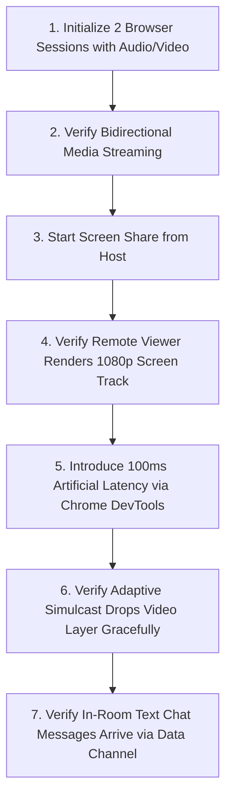

# Test Strategy & Quality Assurance Plan — StudySync

---

## 1. Quality Objectives & Test Philosophy

The primary objective of the StudySync Quality Assurance strategy is to guarantee that students experience zero academic interruption, data loss, or privacy leaks while studying. 

### 1.1 Core Quality Standards
1. **Zero Data Leaks**: Strict automated validation of Row-Level Security (RLS) policies to ensure private notes never cross tenant boundaries.
2. **Reliable WebRTC Collaboration**: Video/audio study rooms must maintain stability and gracefully handle packet loss, camera toggling, and brief network dropouts.
3. **High Performance & Accessibility**: Fast page loads (< 1.5s) and WCAG 2.1 Level AA accessibility compliance across all interactive screens.

---

## 2. Test Pyramid & Tooling Architecture

```
            ▲
           / \
          /   \     E2E Tests (Playwright)
         /  ▲  \    - Complete user journeys from auth to live rooms
        /  / \  \
       /  /   \  \   Integration Tests (Fastify inject / Supabase Test Client)
      /  /  ▲  \  \  - Route handlers, JWT validation, RLS boundary tests
     /  /  / \  \  \
    /  /  /   \  \  \ Unit Tests (Vitest + Testing Library)
   /  /  /     \  \  \ - Utility functions, component rendering, token minting
  ─────────────────────
```

| Tier | Target Subsystems | Framework / Runner | Target Coverage | Execution Frequency |
| :--- | :--- | :--- | :--- | :--- |
| **Unit Tests** | Helper functions, Fastify middleware, pure React UI logic | Vitest | > 80% line coverage | On every commit & PR |
| **Integration Tests** | Fastify route endpoints, Supabase Auth mocks, LiveKit token SDK | Vitest + Fastify `inject()` | > 85% route coverage | On PR to develop/main |
| **E2E Tests** | Authentication, Live Room joining, Note upload, Task manager | Playwright | Critical user journeys | Nightly & Pre-release |
| **Accessibility Tests** | WCAG 2.1 AA automated audits | axe-core / Playwright | 0 violations | Pre-release |

---

## 3. Test Scenarios & Acceptance Criteria

### 3.1 Test Suite 1: Authentication & Access Control
* **Test Case `TC-AUTH-01`**: Valid credentials successfully log user in and populate Supabase session in `localStorage`.
* **Test Case `TC-AUTH-02`**: Unauthenticated request to `GET /api/user/profile` without Bearer header returns HTTP `401 Unauthorized`.
* **Test Case `TC-AUTH-03`**: Malformed or expired JWT Bearer header returns HTTP `401 Unauthorized` with `"Unauthorized: Invalid token"`.
* **Test Case `TC-AUTH-04`**: Attempting to escalate role via `PUT /api/user/profile` with `{ "role": "admin" }` successfully updates profile but retains default student permissions (role is purged).

---

### 3.2 Test Suite 2: Live Collaborative Study Rooms (WebRTC)
* **Test Case `TC-LIVE-01`**: Request to `POST /api/live/token` with valid JWT and `{ roomName, participantName }` returns a signed LiveKit JWT containing matching `roomJoin` and `identity` grants.
* **Test Case `TC-LIVE-02`**: LiveKit token generation without `roomName` returns HTTP `400 Bad Request`.
* **Test Case `TC-LIVE-03`**: Two browser contexts connecting to the same LiveKit room name can successfully negotiate WebRTC peer connections and publish/subscribe audio/video tracks.
* **Test Case `TC-LIVE-04`**: Muting microphone locally stops audio transmission to remote participants without dropping the WebRTC session.
* **Test Case `TC-LIVE-05`**: Disconnecting Wi-Fi for 5 seconds triggers the LiveKit automatic reconnection sequence and resumes video upon reconnection.

---

### 3.3 Test Suite 3: Resource Library & Storage Isolation
* **Test Case `TC-RES-01`**: Uploading a 2 MB PDF file to `resource-originals` under `<user_id>/<file_id>.pdf` succeeds and creates corresponding entries in `resources` and `resource_files`.
* **Test Case `TC-RES-02`**: User B querying `SELECT * FROM resources WHERE owner_id = '<user_A_id>'` receives 0 rows due to RLS filter.
* **Test Case `TC-RES-03`**: Attempting to upload a 60 MB file triggers client-side size rejection and fails PostgreSQL check constraint `size_bytes <= 52428800`.
* **Test Case `TC-RES-04`**: Soft-deleting a resource updates `deleted_at` and removes the resource from active library queries.

---

### 3.4 Test Suite 4: Study Planner & Task Management
* **Test Case `TC-PLAN-01`**: Changing planner mode between `Daily`, `Weekly`, and `Monthly` updates the calendar grid without losing active filter state.
* **Test Case `TC-PLAN-02`**: Starting the Pomodoro timer counts down 25 minutes; pausing freezes the clock; resetting restores initial state.
* **Test Case `TC-TSK-01`**: Creating a task with priority `High` and group `TODAY` renders immediately in the `TODAY` Kanban column.
* **Test Case `TC-TSK-02`**: Checking off a task toggles `completed = true`, applies strike-through styling, and updates the daily streak metric.

---

## 4. WebRTC Performance & Media Testing Protocol

Due to the real-time nature of LiveKit WebRTC audio/video rooms, QA teams should follow this manual and automated verification procedure:



---

## 5. Automated CI Test Commands

Run the full testing and quality verification pipeline locally:

```bash
# 1. Typecheck and lint Backend
cd Backend/server
npm run typecheck

# 2. Typecheck Frontend
cd ../../Frontend/StudySync
npm run typecheck

# 3. Build verification
npm run build
```
